# A Random Forest for the Trees
_Predicting tree cover types from cartographic data using machine learning_

Throughout the western United States, there are large tracts of land that have seen little direct human intervention, at least since the US government displaced the native peoples of these areas. These lands contain a wealth of ecological information and natural resources, but it can be challenging to use or preserve these resources without detailed knowledge about what is there and how it may be evolving as local and global climates change. 

To access this data directly can be prohibitively difficult and expensive. Field surveys require time and personnel, and remote sensing can generate huge amounts of data that must be processed and stored.

An alternative is to use machine learning to try to infer ecological information from data that we already have. In 1999, J. A. Blackard and D. J. Dean published an article in _Computers and Electronics in Agriculture_ demonstrating how two machine learning techniques (an artificial neural network and discriminant analysis) could be used to predict the type of tree cover on a 30 by 30 meter tract of land using only existing cartographic data such as elevation, horizontal distance to water, and soil type. The dataset comprised over half a million observations with 54 features representing tracts of land in four wilderness areas in Colorado, previously in the territories of the Sioux, Ute, Eastern Shoshone, Arapaho, and/or Cheyenne. Blackard and Dean were able to predict tree cover type with 70.58% accuracy using their artificial neural network. 

Twenty years after Blackard and Dean's study, computational efficiency has improved substantially. This project aims to match or exceed Blackard and Dean's accuracy using a Random Forest classifier, ensemble methods (XGBoost), Support Vector Machines, or a combination of these algorithms. 

The value of this analysis is that ecological features that would be difficult to measure directly can be predicted from existing data, and these predictions can later be validated with selective use of richer data (e.g., satellite imaging)&mdash;or the historic results can be compared to what we observe in the present and future.

J. A. Blackard and D. J. Dean, "Comparative accuracies of artificial neural networks and discriminant analysis in predicting forest cover types from cartographic variables," _Computers and Electronics in Agriculture_ 24 (1999), 131-51. (DOI: [10.1016/S0168-1699(99)00046-0](https://www.researchgate.net/publication/222499246_Comparative_Accuracies_of_Artificial_Neural_Networks_and_Discriminant_Analysis_in_Predicting_Forest_Cover_Types_from_Cartographic_Variables))


## Summary of findings

(For more details, see _Interpretations and Recommendations_ below).

* Overall, my best-performing model was a Random Forest with 100 estimators, a maximum tree depth of 25, and a maximum of 30 features. This model achieved an accuracy of 88% on holdout data, exceeding the benchmark established by Blackard and Dean (70.58%) in 1998 (see citation above). 

* An interesting feature of all my models is that they predict class 5 (Aspen) with low precision and high recall, most often misclassifying classes 1 and 2 as 5. This could be corrected with additional training or by trying additional models.

## About this repo

This repository contains the following files:

* **random-forest-for-trees**: Jupyter Notebook containing project code

* **presentation.pdf**: PDF file containing slides from a non-technical presentation of project results

The original dataset is about 75MB, and it can be found at http://kdd.ics.uci.edu/databases/covertype/. A description of the dataset, including a data dictionary, is here: http://kdd.ics.uci.edu/databases/covertype/covertype.data.html.

For more technical details, see the Appendix below.

# Getting started

## Custom functions

Below are several functions I created to help with repetitive tasks.


```python
# Define a function to print selected model metrics
def print_metrics(y_true, y_pred):
    '''Print accuracy score, confusion matrix, and classification report.
    
    Keyword arguments:
    y_true: groud-truth labels
    y_pred: predicted labels
    
    Dependencies: 
    sklearn.metrics.accuracy_score
    sklearn.metrics.confusion_matrix
    sklearn.metrics.classification_report
    '''
    acc_score = accuracy_score(y_true, y_pred)
    conf_matrix = confusion_matrix(y_true, y_pred)
    class_report = classification_report(y_true, y_pred)
    print('Accuracy:', acc_score)
    print('-------')
    print('Confusion matrix:')
    print(conf_matrix)
    print('-------')
    print('Classification report:')
    print(class_report)

```


```python
# Define a function to visualize feature importances
def plot_feature_importances(model, x):
    '''Display barplot representing a model's feature importances.
    
    Note that in a Jupyter Notebook, running this function will display
    the plot automatically.
    
    Keyword arguments:
    model: a trained classifier with .feature_importances_ attribute
    x: the training dataset or other object of identical dimensions
    
    Dependencies:
    matplotlib.pyplot aliased as plt
    '''
    n_features = x.shape[1]
    plt.figure(figsize=(8,10))
    plt.barh(range(n_features), model.feature_importances_, align='center') 
    plt.yticks(np.arange(n_features), range(1, n_features+1)) 
    plt.xlabel("Feature importance")
    plt.ylabel("Feature (Component)")
    plt.title('Feature Importances')

```


```python
# Define a function to visualize a confusion matrix
def pretty_confusion(y_true, y_pred, model_name):
    '''Display normalized confusion matrix with color scale.
    
    Note that this function works specifically for data from the 
    Forest Cover Types dataset. 
    
    Keyword arguments:
    y_true: ground-truth labels
    y_pred: predicted labels
    model_name: name to print in the plot title
    
    Dependencies:
    numpy aliased as np
    sklearn.metrics.confusion_matrix
    matplotlib.pyplot aliased as plt
    seaborn aliased as sns
    '''
    
    # Calculate the confusion matrix
    matrix = confusion_matrix(y_true, y_pred)
    matrix = matrix.astype('float') / matrix.sum(axis=1)[:, np.newaxis]
    
    # Build the plot
    plt.figure(figsize=(16,7))
    sns.set(font_scale=1.4)
    sns.heatmap(matrix, annot=True, annot_kws={'size':10},
                cmap=plt.cm.Greens, linewidths=0.2)
    
    # Add labels to the plot
    class_names = ['Spruce/Fir', 'Lodgepole Pine', 'Ponderosa Pine', 
                   'Cottonwood/Willow', 'Aspen', 'Douglas-fir', 'Krummholz']
    tick_marks = np.arange(len(class_names))
    tick_marks2 = tick_marks + 0.5
    plt.xticks(tick_marks, class_names, rotation=25)
    plt.yticks(tick_marks2, class_names, rotation=0)
    plt.xlabel('Predicted label')
    plt.ylabel('True label')
    plt.title('Confusion Matrix for {}'.format(model_name)) 
    plt.tight_layout()
    
    
# Define a function to save a confusion matrix visualization    
def save_conf_matrix(y_true, y_pred, model_name):
    '''Save normalized confusion matrix with color scale as .png file.
    
    Note that in Jupyter Notebook, the plot will also be displayed
    automatically on calling this function. This function saves .png files
    with 300 dpi and 0.5-in. padding.
    
    Keyword arguments:
    y_true: ground-truth labels
    y_pred: predicted labels
    model_name: name to print in the plot title
    
    Dependencies:
    sklearn.metrics.confusion_matrix
    matplotlib.pyplot aliased as plt
    seaborn aliased as sns
    '''
    fig = pretty_confusion(y_true, y_pred, model_name)
    filename = '_'.join(model_name.split()) + '_confmatrix.png'
    plt.savefig(filename, pad_inches=0.5, dpi=300)
```


```python
def roc_it(y_true, y_pred, model_name, figsize=(12,10)):
    '''Plot ROC with a separate curve for each class.
    
        Keyword arguments:
    y_true: ground-truth labels
    y_pred: predicted labels
    model_name: name to print in the plot title
    
    Dependencies:
    pandas aliased as pd
    sklearn.metrics.roc_curve
    sklearn.metrics.auc
    matplotlib.pyplot aliased as plt
    '''
    y_true_dum = pd.get_dummies(y_true)
    y_pred_dum = pd.get_dummies(y_pred)
    n_classes = y_true.nunique()
    
    fprs = []
    tprs = []
    aucs = []

    for i in range(1,n_classes+1):
        fpr, tpr, _ = roc_curve(y_true_dum.loc[:,i], y_pred_dum.loc[:,i])
        fprs.append(fpr)
        tprs.append(tpr)
        aucs.append(round(auc(fpr, tpr),2))
        
    plt.figure(figsize=(12,10))
    for i in range(n_classes):
        plt.plot(fprs[i], tprs[i], label='Class: {}, AUC: {}'.format(i+1, 
                                                                     aucs[i]))
    plt.plot([0.0,1.0], [0.0,1.0], linestyle='--')
    plt.title('ROC curves by class for {}'.format(model_name))
    plt.xlabel('False Positive Rate')
    plt.ylabel('True Positive Rate')
    plt.legend();
```

## Load and clean data


```python
# Import packages
import pandas as pd
import numpy as np
import matplotlib.pyplot as plt
%matplotlib inline
import seaborn as sns
import itertools
import pickle

from collections import Counter
from imblearn.under_sampling import RandomUnderSampler
from imblearn.over_sampling import SMOTE
from sklearn.preprocessing import MinMaxScaler
from sklearn.preprocessing import StandardScaler
from sklearn.decomposition import PCA
from sklearn.pipeline import Pipeline
from sklearn.model_selection import train_test_split
from sklearn.model_selection import GridSearchCV
import xgboost as xgb
from sklearn.svm import SVC
from sklearn.ensemble import RandomForestClassifier
from sklearn.model_selection import train_test_split
from sklearn.metrics import (accuracy_score, confusion_matrix, 
                             classification_report, roc_curve, auc)
```

The original dataset is about 75MB, and it can be found at http://kdd.ics.uci.edu/databases/covertype/. A description of the dataset, including a data dictionary, is here: http://kdd.ics.uci.edu/databases/covertype/covertype.data.html.

Below I show two ways to get the data. The first is specific to me; when I'm running the notebook in Google Colab, I mount my Google Drive and access the copy of my data that lives there. The second is more generic; it assumes you have a copy of the dataset in the same folder as the Jupyter Notebook. If you're running this notebook on your own machine, you may want to download a copy of the dataset and use the second method.


```python
# Import method 1: in Colab, mount Drive and then use Pandas
from google.colab import drive
drive.mount('/content/drive')
```

    Go to this URL in a browser: _(If you run the notebook, you'll get a URL specific to your Google Drive.)_
    
    Enter your authorization code: _(Your code would go here.)_

    Mounted at /content/drive


```python
# Import method 1 cont'd: read in the data
df = pd.read_table("/content/drive/My Drive/fs-project-4/covtype.data", sep=',', header=None)
df.head()
```


<div>
<style scoped>
    .dataframe tbody tr th:only-of-type {
        vertical-align: middle;
    }

    .dataframe tbody tr th {
        vertical-align: top;
    }

    .dataframe thead th {
        text-align: right;
    }
</style>
<table border="1" class="dataframe">
  <thead>
    <tr style="text-align: right;">
      <th></th>
      <th>0</th>
      <th>1</th>
      <th>2</th>
      <th>3</th>
      <th>4</th>
      <th>5</th>
      <th>6</th>
      <th>7</th>
      <th>8</th>
      <th>9</th>
      <th>10</th>
      <th>11</th>
      <th>12</th>
      <th>13</th>
      <th>14</th>
      <th>15</th>
      <th>16</th>
      <th>17</th>
      <th>18</th>
      <th>19</th>
      <th>20</th>
      <th>21</th>
      <th>22</th>
      <th>23</th>
      <th>24</th>
      <th>25</th>
      <th>26</th>
      <th>27</th>
      <th>28</th>
      <th>29</th>
      <th>30</th>
      <th>31</th>
      <th>32</th>
      <th>33</th>
      <th>34</th>
      <th>35</th>
      <th>36</th>
      <th>37</th>
      <th>38</th>
      <th>39</th>
      <th>40</th>
      <th>41</th>
      <th>42</th>
      <th>43</th>
      <th>44</th>
      <th>45</th>
      <th>46</th>
      <th>47</th>
      <th>48</th>
      <th>49</th>
      <th>50</th>
      <th>51</th>
      <th>52</th>
      <th>53</th>
      <th>54</th>
    </tr>
  </thead>
  <tbody>
    <tr>
      <th>0</th>
      <td>2596</td>
      <td>51</td>
      <td>3</td>
      <td>258</td>
      <td>0</td>
      <td>510</td>
      <td>221</td>
      <td>232</td>
      <td>148</td>
      <td>6279</td>
      <td>1</td>
      <td>0</td>
      <td>0</td>
      <td>0</td>
      <td>0</td>
      <td>0</td>
      <td>0</td>
      <td>0</td>
      <td>0</td>
      <td>0</td>
      <td>0</td>
      <td>0</td>
      <td>0</td>
      <td>0</td>
      <td>0</td>
      <td>0</td>
      <td>0</td>
      <td>0</td>
      <td>0</td>
      <td>0</td>
      <td>0</td>
      <td>0</td>
      <td>0</td>
      <td>0</td>
      <td>0</td>
      <td>0</td>
      <td>0</td>
      <td>0</td>
      <td>0</td>
      <td>0</td>
      <td>0</td>
      <td>0</td>
      <td>1</td>
      <td>0</td>
      <td>0</td>
      <td>0</td>
      <td>0</td>
      <td>0</td>
      <td>0</td>
      <td>0</td>
      <td>0</td>
      <td>0</td>
      <td>0</td>
      <td>0</td>
      <td>5</td>
    </tr>
    <tr>
      <th>1</th>
      <td>2590</td>
      <td>56</td>
      <td>2</td>
      <td>212</td>
      <td>-6</td>
      <td>390</td>
      <td>220</td>
      <td>235</td>
      <td>151</td>
      <td>6225</td>
      <td>1</td>
      <td>0</td>
      <td>0</td>
      <td>0</td>
      <td>0</td>
      <td>0</td>
      <td>0</td>
      <td>0</td>
      <td>0</td>
      <td>0</td>
      <td>0</td>
      <td>0</td>
      <td>0</td>
      <td>0</td>
      <td>0</td>
      <td>0</td>
      <td>0</td>
      <td>0</td>
      <td>0</td>
      <td>0</td>
      <td>0</td>
      <td>0</td>
      <td>0</td>
      <td>0</td>
      <td>0</td>
      <td>0</td>
      <td>0</td>
      <td>0</td>
      <td>0</td>
      <td>0</td>
      <td>0</td>
      <td>0</td>
      <td>1</td>
      <td>0</td>
      <td>0</td>
      <td>0</td>
      <td>0</td>
      <td>0</td>
      <td>0</td>
      <td>0</td>
      <td>0</td>
      <td>0</td>
      <td>0</td>
      <td>0</td>
      <td>5</td>
    </tr>
    <tr>
      <th>2</th>
      <td>2804</td>
      <td>139</td>
      <td>9</td>
      <td>268</td>
      <td>65</td>
      <td>3180</td>
      <td>234</td>
      <td>238</td>
      <td>135</td>
      <td>6121</td>
      <td>1</td>
      <td>0</td>
      <td>0</td>
      <td>0</td>
      <td>0</td>
      <td>0</td>
      <td>0</td>
      <td>0</td>
      <td>0</td>
      <td>0</td>
      <td>0</td>
      <td>0</td>
      <td>0</td>
      <td>0</td>
      <td>0</td>
      <td>1</td>
      <td>0</td>
      <td>0</td>
      <td>0</td>
      <td>0</td>
      <td>0</td>
      <td>0</td>
      <td>0</td>
      <td>0</td>
      <td>0</td>
      <td>0</td>
      <td>0</td>
      <td>0</td>
      <td>0</td>
      <td>0</td>
      <td>0</td>
      <td>0</td>
      <td>0</td>
      <td>0</td>
      <td>0</td>
      <td>0</td>
      <td>0</td>
      <td>0</td>
      <td>0</td>
      <td>0</td>
      <td>0</td>
      <td>0</td>
      <td>0</td>
      <td>0</td>
      <td>2</td>
    </tr>
    <tr>
      <th>3</th>
      <td>2785</td>
      <td>155</td>
      <td>18</td>
      <td>242</td>
      <td>118</td>
      <td>3090</td>
      <td>238</td>
      <td>238</td>
      <td>122</td>
      <td>6211</td>
      <td>1</td>
      <td>0</td>
      <td>0</td>
      <td>0</td>
      <td>0</td>
      <td>0</td>
      <td>0</td>
      <td>0</td>
      <td>0</td>
      <td>0</td>
      <td>0</td>
      <td>0</td>
      <td>0</td>
      <td>0</td>
      <td>0</td>
      <td>0</td>
      <td>0</td>
      <td>0</td>
      <td>0</td>
      <td>0</td>
      <td>0</td>
      <td>0</td>
      <td>0</td>
      <td>0</td>
      <td>0</td>
      <td>0</td>
      <td>0</td>
      <td>0</td>
      <td>0</td>
      <td>0</td>
      <td>0</td>
      <td>0</td>
      <td>0</td>
      <td>1</td>
      <td>0</td>
      <td>0</td>
      <td>0</td>
      <td>0</td>
      <td>0</td>
      <td>0</td>
      <td>0</td>
      <td>0</td>
      <td>0</td>
      <td>0</td>
      <td>2</td>
    </tr>
    <tr>
      <th>4</th>
      <td>2595</td>
      <td>45</td>
      <td>2</td>
      <td>153</td>
      <td>-1</td>
      <td>391</td>
      <td>220</td>
      <td>234</td>
      <td>150</td>
      <td>6172</td>
      <td>1</td>
      <td>0</td>
      <td>0</td>
      <td>0</td>
      <td>0</td>
      <td>0</td>
      <td>0</td>
      <td>0</td>
      <td>0</td>
      <td>0</td>
      <td>0</td>
      <td>0</td>
      <td>0</td>
      <td>0</td>
      <td>0</td>
      <td>0</td>
      <td>0</td>
      <td>0</td>
      <td>0</td>
      <td>0</td>
      <td>0</td>
      <td>0</td>
      <td>0</td>
      <td>0</td>
      <td>0</td>
      <td>0</td>
      <td>0</td>
      <td>0</td>
      <td>0</td>
      <td>0</td>
      <td>0</td>
      <td>0</td>
      <td>1</td>
      <td>0</td>
      <td>0</td>
      <td>0</td>
      <td>0</td>
      <td>0</td>
      <td>0</td>
      <td>0</td>
      <td>0</td>
      <td>0</td>
      <td>0</td>
      <td>0</td>
      <td>5</td>
    </tr>
  </tbody>
</table>
</div>


```python
# Import method 2: read in the data (stored locally)
df = pd.read_table("covtype.data", sep=',', header=None)
df.head()
```


<div>
<style scoped>
    .dataframe tbody tr th:only-of-type {
        vertical-align: middle;
    }

    .dataframe tbody tr th {
        vertical-align: top;
    }

    .dataframe thead th {
        text-align: right;
    }
</style>
<table border="1" class="dataframe">
  <thead>
    <tr style="text-align: right;">
      <th></th>
      <th>0</th>
      <th>1</th>
      <th>2</th>
      <th>3</th>
      <th>4</th>
      <th>5</th>
      <th>6</th>
      <th>7</th>
      <th>8</th>
      <th>9</th>
      <th>...</th>
      <th>45</th>
      <th>46</th>
      <th>47</th>
      <th>48</th>
      <th>49</th>
      <th>50</th>
      <th>51</th>
      <th>52</th>
      <th>53</th>
      <th>54</th>
    </tr>
  </thead>
  <tbody>
    <tr>
      <td>0</td>
      <td>2596</td>
      <td>51</td>
      <td>3</td>
      <td>258</td>
      <td>0</td>
      <td>510</td>
      <td>221</td>
      <td>232</td>
      <td>148</td>
      <td>6279</td>
      <td>...</td>
      <td>0</td>
      <td>0</td>
      <td>0</td>
      <td>0</td>
      <td>0</td>
      <td>0</td>
      <td>0</td>
      <td>0</td>
      <td>0</td>
      <td>5</td>
    </tr>
    <tr>
      <td>1</td>
      <td>2590</td>
      <td>56</td>
      <td>2</td>
      <td>212</td>
      <td>-6</td>
      <td>390</td>
      <td>220</td>
      <td>235</td>
      <td>151</td>
      <td>6225</td>
      <td>...</td>
      <td>0</td>
      <td>0</td>
      <td>0</td>
      <td>0</td>
      <td>0</td>
      <td>0</td>
      <td>0</td>
      <td>0</td>
      <td>0</td>
      <td>5</td>
    </tr>
    <tr>
      <td>2</td>
      <td>2804</td>
      <td>139</td>
      <td>9</td>
      <td>268</td>
      <td>65</td>
      <td>3180</td>
      <td>234</td>
      <td>238</td>
      <td>135</td>
      <td>6121</td>
      <td>...</td>
      <td>0</td>
      <td>0</td>
      <td>0</td>
      <td>0</td>
      <td>0</td>
      <td>0</td>
      <td>0</td>
      <td>0</td>
      <td>0</td>
      <td>2</td>
    </tr>
    <tr>
      <td>3</td>
      <td>2785</td>
      <td>155</td>
      <td>18</td>
      <td>242</td>
      <td>118</td>
      <td>3090</td>
      <td>238</td>
      <td>238</td>
      <td>122</td>
      <td>6211</td>
      <td>...</td>
      <td>0</td>
      <td>0</td>
      <td>0</td>
      <td>0</td>
      <td>0</td>
      <td>0</td>
      <td>0</td>
      <td>0</td>
      <td>0</td>
      <td>2</td>
    </tr>
    <tr>
      <td>4</td>
      <td>2595</td>
      <td>45</td>
      <td>2</td>
      <td>153</td>
      <td>-1</td>
      <td>391</td>
      <td>220</td>
      <td>234</td>
      <td>150</td>
      <td>6172</td>
      <td>...</td>
      <td>0</td>
      <td>0</td>
      <td>0</td>
      <td>0</td>
      <td>0</td>
      <td>0</td>
      <td>0</td>
      <td>0</td>
      <td>0</td>
      <td>5</td>
    </tr>
  </tbody>
</table>
<p>5 rows × 55 columns</p>
</div>


The data comes without column names, so in the next few cells, I generate and insert those.


```python
# Generate column names for the 40 soil type columns
soil_types = []
for n in range(1, 41):
    str_n = str(n)
    name = 'Soil_Type_' + str_n
    soil_types.append(name)
    
print(soil_types)
```

    ['Soil_Type_1', 'Soil_Type_2', 'Soil_Type_3', 'Soil_Type_4', 'Soil_Type_5', 'Soil_Type_6', 'Soil_Type_7', 'Soil_Type_8', 'Soil_Type_9', 'Soil_Type_10', 'Soil_Type_11', 'Soil_Type_12', 'Soil_Type_13', 'Soil_Type_14', 'Soil_Type_15', 'Soil_Type_16', 'Soil_Type_17', 'Soil_Type_18', 'Soil_Type_19', 'Soil_Type_20', 'Soil_Type_21', 'Soil_Type_22', 'Soil_Type_23', 'Soil_Type_24', 'Soil_Type_25', 'Soil_Type_26', 'Soil_Type_27', 'Soil_Type_28', 'Soil_Type_29', 'Soil_Type_30', 'Soil_Type_31', 'Soil_Type_32', 'Soil_Type_33', 'Soil_Type_34', 'Soil_Type_35', 'Soil_Type_36', 'Soil_Type_37', 'Soil_Type_38', 'Soil_Type_39', 'Soil_Type_40']


```python
# Name the columns
colnames = ['Elevation', 'Aspect', 'Slope', 'Hor_Dist_Hyd', 'Ver_Dist_Hyd',
            'Hor_Dist_Road', 'Hillshade_9am', 'Hillshade_noon', 'Hillshade_3pm',
            'Hor_Dist_Fire', 'WA_1', 'WA_2', 'WA_3', 'WA_4', 'Soil_Type_1', 
            'Soil_Type_2', 'Soil_Type_3', 'Soil_Type_4', 'Soil_Type_5', 
            'Soil_Type_6', 'Soil_Type_7', 'Soil_Type_8', 'Soil_Type_9', 
            'Soil_Type_10', 'Soil_Type_11', 'Soil_Type_12', 'Soil_Type_13', 
            'Soil_Type_14', 'Soil_Type_15', 'Soil_Type_16', 'Soil_Type_17', 
            'Soil_Type_18', 'Soil_Type_19', 'Soil_Type_20', 'Soil_Type_21', 
            'Soil_Type_22', 'Soil_Type_23', 'Soil_Type_24', 'Soil_Type_25', 
            'Soil_Type_26', 'Soil_Type_27', 'Soil_Type_28', 'Soil_Type_29', 
            'Soil_Type_30', 'Soil_Type_31', 'Soil_Type_32', 'Soil_Type_33', 
            'Soil_Type_34', 'Soil_Type_35', 'Soil_Type_36', 'Soil_Type_37', 
            'Soil_Type_38', 'Soil_Type_39', 'Soil_Type_40', 'Cover_Type',]
df.columns = colnames
df.info()
```

    <class 'pandas.core.frame.DataFrame'>  
    RangeIndex: 581012 entries, 0 to 581011  
    Data columns (total 55 columns):  
    Elevation         581012 non-null int64  
    Aspect            581012 non-null int64  
    Slope             581012 non-null int64  
    Hor_Dist_Hyd      581012 non-null int64  
    Ver_Dist_Hyd      581012 non-null int64  
    Hor_Dist_Road     581012 non-null int64 
    Hillshade_9am     581012 non-null int64  
    Hillshade_noon    581012 non-null int64  
    Hillshade_3pm     581012 non-null int64  
    Hor_Dist_Fire     581012 non-null int64  
    WA_1              581012 non-null int64  
    WA_2              581012 non-null int64  
    WA_3              581012 non-null int64  
    WA_4              581012 non-null int64  
    Soil_Type_1       581012 non-null int64  
    Soil_Type_2       581012 non-null int64  
    Soil_Type_3       581012 non-null int64  
    Soil_Type_4       581012 non-null int64  
    Soil_Type_5       581012 non-null int64  
    Soil_Type_6       581012 non-null int64  
    Soil_Type_7       581012 non-null int64  
    Soil_Type_8       581012 non-null int64  
    Soil_Type_9       581012 non-null int64  
    Soil_Type_10      581012 non-null int64  
    Soil_Type_11      581012 non-null int64  
    Soil_Type_12      581012 non-null int64  
    Soil_Type_13      581012 non-null int64  
    Soil_Type_14      581012 non-null int64  
    Soil_Type_15      581012 non-null int64  
    Soil_Type_16      581012 non-null int64  
    Soil_Type_17      581012 non-null int64  
    Soil_Type_18      581012 non-null int64  
    Soil_Type_19      581012 non-null int64  
    Soil_Type_20      581012 non-null int64  
    Soil_Type_21      581012 non-null int64  
    Soil_Type_22      581012 non-null int64  
    Soil_Type_23      581012 non-null int64  
    Soil_Type_24      581012 non-null int64  
    Soil_Type_25      581012 non-null int64  
    Soil_Type_26      581012 non-null int64  
    Soil_Type_27      581012 non-null int64  
    Soil_Type_28      581012 non-null int64  
    Soil_Type_29      581012 non-null int64  
    Soil_Type_30      581012 non-null int64  
    Soil_Type_31      581012 non-null int64  
    Soil_Type_32      581012 non-null int64  
    Soil_Type_33      581012 non-null int64  
    Soil_Type_34      581012 non-null int64  
    Soil_Type_35      581012 non-null int64  
    Soil_Type_36      581012 non-null int64  
    Soil_Type_37      581012 non-null int64  
    Soil_Type_38      581012 non-null int64  
    Soil_Type_39      581012 non-null int64  
    Soil_Type_40      581012 non-null int64  
    Cover_Type        581012 non-null int64  
    dtypes: int64(55)  
    memory usage: 243.8 MB


Every observation in this dataset represents a 30 by 30-meter tract of land in one of four forest preserves in Colorado. The first 10 columns describe features of each land tract that are pretty self-explanatory (see the data dictionary referenced above). The columns named 'WA_#' are binary columns representing which of the four wilderness areas the observation pertains to. These are followed by 40 binary columns recording what type of soil is present in the tract. Last is 'Cover_Type,' which records which of 7 tree types was predominant in the tract. See the non-technical visualizations below for a look at the breakdown of tree cover types and wilderness areas.

## EDA

### General EDA

Here I will do a little exploratory analysis, mostly for the purposes of summarizing this dataset for a non-technical audience.

First, I want to create a barplot showing how many instances of each tree cover type there are.


```python
# Get tree type counts
tree_dict = {1:'Spruce/Fir', 
             2:'Lodgepole Pine', 
             3:'Ponderosa Pine',
             4:'Cottonwood/Willow', 
             5:'Aspen', 
             6:'Douglas-fir', 
             7:'Krummholz'}

tree_list = list(tree_dict.values())

class_counts = [df.Cover_Type.value_counts()[i] for i in range(1,8)]

tree_counts = sorted(list(zip(tree_list, class_counts)), 
                     key=lambda x:x[1], reverse=True)
```


```python
# Plot tree type counts
sns.set_context('talk')
sns.set_style('white')
plt.figure(figsize=(6,8))
plt.barh(width=[x[1] for x in tree_counts], 
         y=[x[0] for x in tree_counts], 
         color='darkgreen')
plt.yticks(ticks=list(range(0,7)), labels=[x[0] for x in tree_counts])
plt.xticks(ticks=[5e4, 10e4, 15e4, 20e4, 25e4], 
           labels=['50k', '100k', '150k', '200k', '250k'])
plt.xlabel('Number of tracts')
plt.title('Land tracts with various tree cover types')
sns.despine()
plt.savefig('cover_type_counts.png', dpi=300, pad_inches=0.5)
plt.show();
```


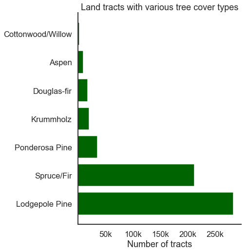


I'm also curious to know how the four wilderness areas compare to one another in size (i.e., number of tracts in the dataset).


```python
# Get wilderness area counts
area_names = ['Rawah', 'Neota', 'Comanche Peak', 'Cache la Poudre']
wa_counts = [df.loc[:, 'WA_1':'WA_4'].sum()[i] for i in range(4)]
area_counts = sorted(list(zip(area_names, wa_counts)),
                     key=lambda x:x[1], reverse=True)
area_counts
```


    [('Rawah', 260796),  
     ('Comanche Peak', 253364),  
     ('Cache la Poudre', 36968),  
     ('Neota', 29884)]


```python
# Plot the tract counts for each wilderness area
plt.figure(figsize=(6,8))
plt.barh(y=[x[0] for x in area_counts], width=[x[1] for x in area_counts],
        color='lightgray')
plt.xticks(ticks=[5e4, 10e4, 15e4, 20e4, 25e4], 
           labels=['50k', '100k', '150k', '200k', '250k'])
plt.xlabel('Number of tracts')
plt.title('Tracts recorded in each wilderness area')
sns.despine()
plt.savefig('area_counts.png', dpi=300, pad_inches=0.5)
plt.show();
```


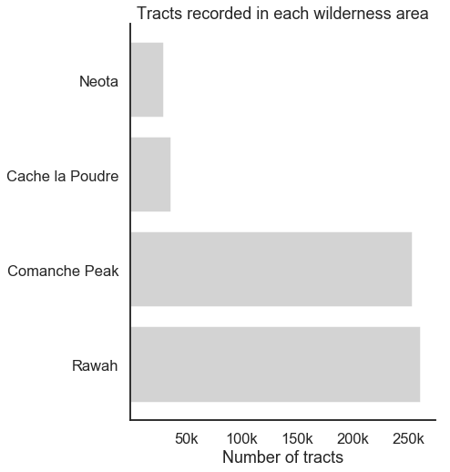


I think it's important to get an idea of how each type of tree cover is represented in each wilderness area. Are there some tree cover types that occur only in certain areas? 


```python
# Copy the dataset and add a column for tree cover type names
df_viz = df.copy()
df_viz['tree'] = [tree_dict[i] for i in df_viz['Cover_Type']]
df_viz['tree']
```


    0                  Aspen  
    1                  Aspen  
    2         Lodgepole Pine  
    3         Lodgepole Pine  
    4                  Aspen  
                   ...        
    581007    Ponderosa Pine  
    581008    Ponderosa Pine  
    581009    Ponderosa Pine  
    581010    Ponderosa Pine  
    581011    Ponderosa Pine  
    Name: tree, Length: 581012, dtype: object


```python
# Get counts of each tree type in each area
wa_1_trees = df_viz.groupby('tree')['WA_1'].sum()
wa_2_trees = df_viz.groupby('tree')['WA_2'].sum()
wa_3_trees = df_viz.groupby('tree')['WA_3'].sum()
wa_4_trees = df_viz.groupby('tree')['WA_4'].sum()
```


```python
# Plot the tree types per area
areas = [wa_1_trees, wa_2_trees, wa_3_trees, wa_4_trees]
yticks = []
xticks_big = [50000, 100000, 150000]
xtick_labels_big = ['50k', '100k', '150k']
xticks_small = [10000, 20000, 22000]
xtick_labels_small = ['10k', '20k', '']

fig = plt.figure(figsize=(16,8))

ax1 = fig.add_subplot(221)
ax1.barh(y=wa_1_trees.index, width=wa_1_trees, color='darkgreen')
ax1.set_title('Rawah')
ax1.set_xticks(xticks)
ax1.set_xticklabels(xtick_labels)

ax2 = fig.add_subplot(222)
ax2.barh(y=wa_2_trees.index, width=wa_2_trees, color='darkgreen')
ax2.set_title('Neota')
ax2.set_yticks(yticks)
ax2.set_xticks(xticks_small)
ax2.set_xticklabels(xtick_labels_small)

ax3 = fig.add_subplot(223)
ax3.barh(y=wa_3_trees.index, width=wa_3_trees, color='darkgreen')
ax3.set_title('Comanche Peak')
ax3.set_xticks(xticks)
ax3.set_xticklabels(xtick_labels)

ax4 = fig.add_subplot(224)
ax4.barh(y=wa_4_trees.index, width=wa_4_trees, color='darkgreen')
ax4.set_title('Cache la Poudre')
ax4.set_yticks(yticks)
ax4.set_xticks(xticks_small)
ax4.set_xticklabels(xtick_labels_small)

plt.suptitle('Tree cover types in each area', y=1.05)
plt.tight_layout()
sns.despine()
plt.savefig('trees_by_area.png', dpi=300, pad_inches=0.5)
```


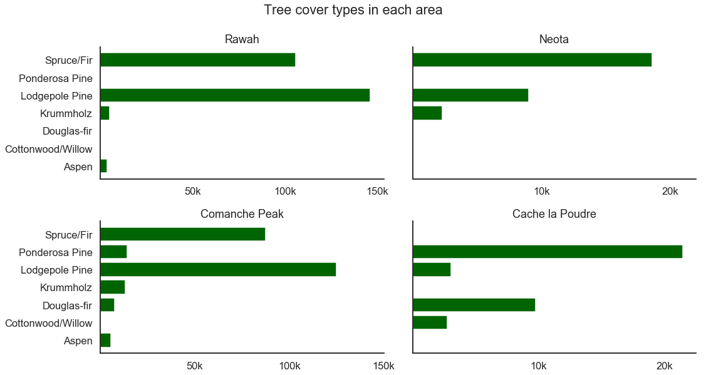


The plots above show that we basically have two large and two small wilderness areas, and each area has a unique distribution of tree types. Rawah, Neota, and Comanche Peak all have Spruce/Fir and Lodgepole Pine as their most common classes, while Cache la Poudre seems to represent a different environment where Ponderosa Pine and Douglas-fir are most common. Knowing how the different types of trees are distributed in each area could help us choose models to use later. For instance, a model that performs well for the three areas with similar tree types might not be such a good choice if we wanted to focus on predictions for Cache la Poudre.

### EDA for modeling

At this early stage, I am concerned about class imbalance, i.e., the possibility that there may be lots of one type of tree cover and few examples of another. This imbalance could cause my machine learning algorithm to find shortcuts to maximizing whatever performance metric we're using, for instance by simply never predicting a rare class.

Let's take a quick look at the counts of each class.


```python
# Check class balance
df.Cover_Type.value_counts()
```


    2    283301  
    1    211840  
    3     35754  
    7     20510  
    6     17367  
    5      9493  
    4      2747  
    Name: Cover_Type, dtype: int64


As I feared, the classes are very imbalanced: the smallest one is just 1% the size of the largest one! I will address this problem in the section on preprocessing below.

Let's take a look at the continuous variables and see whether they are normally distributed, since non-normal distributions can negatively impact our predictive power.


```python
# Visualize distributions of continuous variables
to_hist = ['Elevation', 'Aspect', 'Slope', 'Hor_Dist_Hyd', 'Ver_Dist_Hyd',
           'Hor_Dist_Road', 'Hillshade_9am', 'Hillshade_noon', 'Hillshade_3pm',
           'Hor_Dist_Fire']

plt.figure(figsize=(16,10))
for idx, col in enumerate(to_hist):
    plt.subplot(3, 4, idx+1)
    plt.hist(df[col])
    plt.title(col)
plt.tight_layout();

```


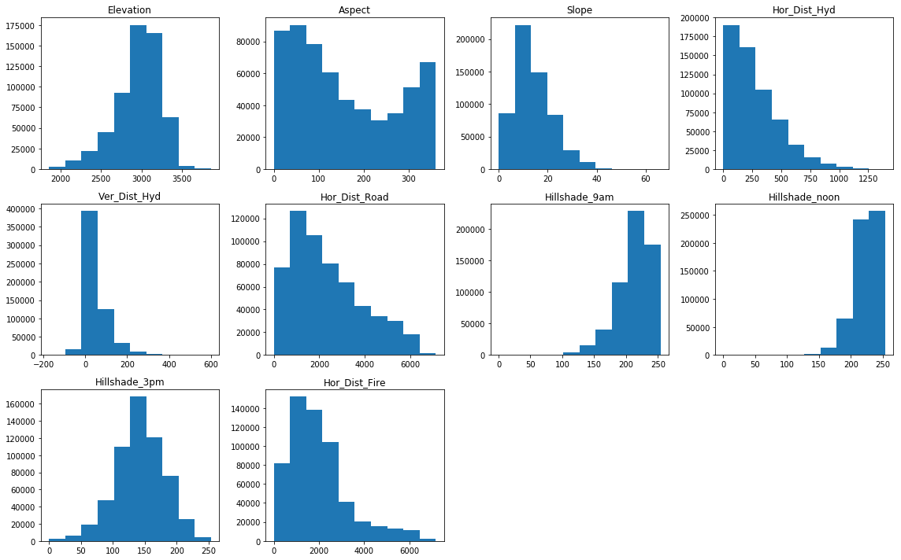


Some of the continuous variables are skewed right or left, and `Aspect` appears to be bimodal. 

I'm also curious to see whether any of the variables are correlated with one another (and therefore could be eliminated). For instance, there might be a soil type that only occurs in one of the forest preserves. A correlation matrix and heatmap can help us detect this, but it's not a big worry. Principal Components Analysis (below) will help us avoid any repercussions of multicollinearity.


```python
# View correlation matrix
df.corr()
```


<div>
<style scoped>
    .dataframe tbody tr th:only-of-type {
        vertical-align: middle;
    }

    .dataframe tbody tr th {
        vertical-align: top;
    }

    .dataframe thead th {
        text-align: right;
    }
</style>
<table border="1" class="dataframe">
  <thead>
    <tr style="text-align: right;">
      <th></th>
      <th>Elevation</th>
      <th>Aspect</th>
      <th>Slope</th>
      <th>Hor_Dist_Hyd</th>
      <th>Ver_Dist_Hyd</th>
      <th>Hor_Dist_Road</th>
      <th>Hillshade_9am</th>
      <th>Hillshade_noon</th>
      <th>Hillshade_3pm</th>
      <th>Hor_Dist_Fire</th>
      <th>...</th>
      <th>Soil_Type_32</th>
      <th>Soil_Type_33</th>
      <th>Soil_Type_34</th>
      <th>Soil_Type_35</th>
      <th>Soil_Type_36</th>
      <th>Soil_Type_37</th>
      <th>Soil_Type_38</th>
      <th>Soil_Type_39</th>
      <th>Soil_Type_40</th>
      <th>Cover_Type</th>
    </tr>
  </thead>
  <tbody>
    <tr>
      <td>Elevation</td>
      <td>1.000000</td>
      <td>0.015735</td>
      <td>-0.242697</td>
      <td>0.306229</td>
      <td>0.093306</td>
      <td>0.365559</td>
      <td>0.112179</td>
      <td>0.205887</td>
      <td>0.059148</td>
      <td>0.148022</td>
      <td>...</td>
      <td>0.167077</td>
      <td>0.070633</td>
      <td>0.011731</td>
      <td>0.083005</td>
      <td>0.021107</td>
      <td>0.035433</td>
      <td>0.217179</td>
      <td>0.193595</td>
      <td>0.212612</td>
      <td>-0.269554</td>
    </tr>
    <tr>
      <td>Aspect</td>
      <td>0.015735</td>
      <td>1.000000</td>
      <td>0.078728</td>
      <td>0.017376</td>
      <td>0.070305</td>
      <td>0.025121</td>
      <td>-0.579273</td>
      <td>0.336103</td>
      <td>0.646944</td>
      <td>-0.109172</td>
      <td>...</td>
      <td>0.056233</td>
      <td>0.019163</td>
      <td>0.010861</td>
      <td>-0.021991</td>
      <td>0.002281</td>
      <td>-0.020398</td>
      <td>0.017706</td>
      <td>0.008294</td>
      <td>-0.005866</td>
      <td>0.017080</td>
    </tr>
    <tr>
      <td>Slope</td>
      <td>-0.242697</td>
      <td>0.078728</td>
      <td>1.000000</td>
      <td>-0.010607</td>
      <td>0.274976</td>
      <td>-0.215914</td>
      <td>-0.327199</td>
      <td>-0.526911</td>
      <td>-0.175854</td>
      <td>-0.185662</td>
      <td>...</td>
      <td>-0.133504</td>
      <td>0.208942</td>
      <td>-0.011002</td>
      <td>-0.022228</td>
      <td>0.002918</td>
      <td>0.007848</td>
      <td>-0.072208</td>
      <td>0.093602</td>
      <td>0.025637</td>
      <td>0.148285</td>
    </tr>
    <tr>
      <td>Hor_Dist_Hyd</td>
      <td>0.306229</td>
      <td>0.017376</td>
      <td>-0.010607</td>
      <td>1.000000</td>
      <td>0.606236</td>
      <td>0.072030</td>
      <td>-0.027088</td>
      <td>0.046790</td>
      <td>0.052330</td>
      <td>0.051874</td>
      <td>...</td>
      <td>0.127217</td>
      <td>0.101195</td>
      <td>0.070268</td>
      <td>-0.005231</td>
      <td>0.033421</td>
      <td>-0.006802</td>
      <td>0.043031</td>
      <td>0.031922</td>
      <td>0.147020</td>
      <td>-0.020317</td>
    </tr>
    <tr>
      <td>Ver_Dist_Hyd</td>
      <td>0.093306</td>
      <td>0.070305</td>
      <td>0.274976</td>
      <td>0.606236</td>
      <td>1.000000</td>
      <td>-0.046372</td>
      <td>-0.166333</td>
      <td>-0.110957</td>
      <td>0.034902</td>
      <td>-0.069913</td>
      <td>...</td>
      <td>0.039762</td>
      <td>0.167091</td>
      <td>0.060274</td>
      <td>-0.006092</td>
      <td>0.012955</td>
      <td>-0.007520</td>
      <td>-0.008629</td>
      <td>0.043859</td>
      <td>0.179006</td>
      <td>0.081664</td>
    </tr>
    <tr>
      <td>Hor_Dist_Road</td>
      <td>0.365559</td>
      <td>0.025121</td>
      <td>-0.215914</td>
      <td>0.072030</td>
      <td>-0.046372</td>
      <td>1.000000</td>
      <td>0.034349</td>
      <td>0.189461</td>
      <td>0.106119</td>
      <td>0.331580</td>
      <td>...</td>
      <td>-0.089019</td>
      <td>-0.082779</td>
      <td>0.006390</td>
      <td>-0.003000</td>
      <td>0.007550</td>
      <td>0.016313</td>
      <td>0.079778</td>
      <td>0.033762</td>
      <td>0.016052</td>
      <td>-0.153450</td>
    </tr>
    <tr>
      <td>Hillshade_9am</td>
      <td>0.112179</td>
      <td>-0.579273</td>
      <td>-0.327199</td>
      <td>-0.027088</td>
      <td>-0.166333</td>
      <td>0.034349</td>
      <td>1.000000</td>
      <td>0.010037</td>
      <td>-0.780296</td>
      <td>0.132669</td>
      <td>...</td>
      <td>0.006494</td>
      <td>-0.064381</td>
      <td>0.007154</td>
      <td>0.027870</td>
      <td>0.007865</td>
      <td>0.010332</td>
      <td>0.015108</td>
      <td>-0.029620</td>
      <td>-0.000016</td>
      <td>-0.035415</td>
    </tr>
    <tr>
      <td>Hillshade_noon</td>
      <td>0.205887</td>
      <td>0.336103</td>
      <td>-0.526911</td>
      <td>0.046790</td>
      <td>-0.110957</td>
      <td>0.189461</td>
      <td>0.010037</td>
      <td>1.000000</td>
      <td>0.594274</td>
      <td>0.057329</td>
      <td>...</td>
      <td>0.125395</td>
      <td>-0.086164</td>
      <td>0.043061</td>
      <td>0.005863</td>
      <td>0.016239</td>
      <td>-0.022707</td>
      <td>0.042952</td>
      <td>-0.071961</td>
      <td>-0.040176</td>
      <td>-0.096426</td>
    </tr>
    <tr>
      <td>Hillshade_3pm</td>
      <td>0.059148</td>
      <td>0.646944</td>
      <td>-0.175854</td>
      <td>0.052330</td>
      <td>0.034902</td>
      <td>0.106119</td>
      <td>-0.780296</td>
      <td>0.594274</td>
      <td>1.000000</td>
      <td>-0.047981</td>
      <td>...</td>
      <td>0.083066</td>
      <td>-0.024393</td>
      <td>0.017757</td>
      <td>-0.016482</td>
      <td>0.001330</td>
      <td>-0.022064</td>
      <td>0.022187</td>
      <td>-0.029040</td>
      <td>-0.024254</td>
      <td>-0.048290</td>
    </tr>
    <tr>
      <td>Hor_Dist_Fire</td>
      <td>0.148022</td>
      <td>-0.109172</td>
      <td>-0.185662</td>
      <td>0.051874</td>
      <td>-0.069913</td>
      <td>0.331580</td>
      <td>0.132669</td>
      <td>0.057329</td>
      <td>-0.047981</td>
      <td>1.000000</td>
      <td>...</td>
      <td>-0.089977</td>
      <td>-0.059067</td>
      <td>-0.035067</td>
      <td>-0.000081</td>
      <td>-0.010595</td>
      <td>0.004180</td>
      <td>-0.019740</td>
      <td>-0.003301</td>
      <td>0.008915</td>
      <td>-0.108936</td>
    </tr>
    <tr>
      <td>WA_1</td>
      <td>0.131838</td>
      <td>-0.140123</td>
      <td>-0.234576</td>
      <td>-0.097124</td>
      <td>-0.180710</td>
      <td>0.453913</td>
      <td>0.201299</td>
      <td>0.028728</td>
      <td>-0.115155</td>
      <td>0.380568</td>
      <td>...</td>
      <td>-0.284490</td>
      <td>-0.261970</td>
      <td>-0.047587</td>
      <td>-0.011714</td>
      <td>-0.012917</td>
      <td>0.015014</td>
      <td>0.011073</td>
      <td>0.012745</td>
      <td>0.011974</td>
      <td>-0.203913</td>
    </tr>
    <tr>
      <td>WA_2</td>
      <td>0.238164</td>
      <td>0.055988</td>
      <td>-0.036253</td>
      <td>0.055726</td>
      <td>-0.008709</td>
      <td>-0.200411</td>
      <td>-0.006181</td>
      <td>0.042392</td>
      <td>0.034707</td>
      <td>0.027473</td>
      <td>...</td>
      <td>0.028797</td>
      <td>0.014393</td>
      <td>-0.012279</td>
      <td>0.055508</td>
      <td>-0.003333</td>
      <td>-0.005275</td>
      <td>0.061369</td>
      <td>0.011301</td>
      <td>0.105050</td>
      <td>-0.048059</td>
    </tr>
    <tr>
      <td>WA_3</td>
      <td>0.066550</td>
      <td>0.074904</td>
      <td>0.125663</td>
      <td>0.122028</td>
      <td>0.146839</td>
      <td>-0.232933</td>
      <td>-0.100565</td>
      <td>0.048646</td>
      <td>0.090757</td>
      <td>-0.277510</td>
      <td>...</td>
      <td>0.312961</td>
      <td>0.293588</td>
      <td>0.059964</td>
      <td>-0.005644</td>
      <td>0.016276</td>
      <td>-0.009803</td>
      <td>-0.017148</td>
      <td>0.002201</td>
      <td>-0.042936</td>
      <td>0.066846</td>
    </tr>
    <tr>
      <td>WA_4</td>
      <td>-0.619374</td>
      <td>0.082687</td>
      <td>0.255503</td>
      <td>-0.100433</td>
      <td>0.077792</td>
      <td>-0.270349</td>
      <td>-0.200282</td>
      <td>-0.195733</td>
      <td>0.018860</td>
      <td>-0.236548</td>
      <td>...</td>
      <td>-0.082174</td>
      <td>-0.075669</td>
      <td>-0.013745</td>
      <td>-0.014896</td>
      <td>-0.003731</td>
      <td>-0.005905</td>
      <td>-0.043260</td>
      <td>-0.040669</td>
      <td>-0.032233</td>
      <td>0.323200</td>
    </tr>
    <tr>
      <td>Soil_Type_1</td>
      <td>-0.204512</td>
      <td>-0.007574</td>
      <td>0.107847</td>
      <td>-0.035096</td>
      <td>0.015275</td>
      <td>-0.083585</td>
      <td>-0.000937</td>
      <td>-0.052561</td>
      <td>-0.050157</td>
      <td>-0.073607</td>
      <td>...</td>
      <td>-0.022828</td>
      <td>-0.021021</td>
      <td>-0.003819</td>
      <td>-0.004138</td>
      <td>-0.001036</td>
      <td>-0.001640</td>
      <td>-0.012018</td>
      <td>-0.011298</td>
      <td>-0.008955</td>
      <td>0.090828</td>
    </tr>
    <tr>
      <td>Soil_Type_2</td>
      <td>-0.187677</td>
      <td>-0.005649</td>
      <td>-0.018553</td>
      <td>-0.011569</td>
      <td>0.008954</td>
      <td>-0.088026</td>
      <td>0.036253</td>
      <td>0.043250</td>
      <td>-0.005276</td>
      <td>-0.081716</td>
      <td>...</td>
      <td>-0.036110</td>
      <td>-0.033252</td>
      <td>-0.006040</td>
      <td>-0.006546</td>
      <td>-0.001640</td>
      <td>-0.002595</td>
      <td>-0.019010</td>
      <td>-0.017871</td>
      <td>-0.014164</td>
      <td>0.118135</td>
    </tr>
    <tr>
      <td>Soil_Type_3</td>
      <td>-0.182463</td>
      <td>-0.002730</td>
      <td>0.125497</td>
      <td>-0.041211</td>
      <td>0.008863</td>
      <td>-0.084988</td>
      <td>0.039648</td>
      <td>0.002702</td>
      <td>-0.060554</td>
      <td>-0.076340</td>
      <td>...</td>
      <td>-0.028841</td>
      <td>-0.026558</td>
      <td>-0.004824</td>
      <td>-0.005228</td>
      <td>-0.001309</td>
      <td>-0.002073</td>
      <td>-0.015183</td>
      <td>-0.014274</td>
      <td>-0.011313</td>
      <td>0.068064</td>
    </tr>
    <tr>
      <td>Soil_Type_4</td>
      <td>-0.183521</td>
      <td>0.017212</td>
      <td>0.131847</td>
      <td>-0.049071</td>
      <td>0.025066</td>
      <td>-0.088524</td>
      <td>0.023812</td>
      <td>0.084397</td>
      <td>-0.004670</td>
      <td>-0.076478</td>
      <td>...</td>
      <td>-0.046545</td>
      <td>-0.042860</td>
      <td>-0.007786</td>
      <td>-0.008437</td>
      <td>-0.002113</td>
      <td>-0.003345</td>
      <td>-0.024503</td>
      <td>-0.023035</td>
      <td>-0.018257</td>
      <td>0.099672</td>
    </tr>
    <tr>
      <td>Soil_Type_5</td>
      <td>-0.150376</td>
      <td>0.008938</td>
      <td>0.072311</td>
      <td>-0.009370</td>
      <td>0.026772</td>
      <td>-0.061607</td>
      <td>-0.046514</td>
      <td>-0.062044</td>
      <td>-0.006900</td>
      <td>-0.051845</td>
      <td>...</td>
      <td>-0.016550</td>
      <td>-0.015240</td>
      <td>-0.002768</td>
      <td>-0.003000</td>
      <td>-0.000751</td>
      <td>-0.001189</td>
      <td>-0.008713</td>
      <td>-0.008191</td>
      <td>-0.006492</td>
      <td>0.077890</td>
    </tr>
    <tr>
      <td>Soil_Type_6</td>
      <td>-0.214606</td>
      <td>0.010766</td>
      <td>0.003673</td>
      <td>-0.012916</td>
      <td>0.046259</td>
      <td>-0.108328</td>
      <td>-0.005665</td>
      <td>-0.010497</td>
      <td>-0.000556</td>
      <td>-0.087305</td>
      <td>...</td>
      <td>-0.033726</td>
      <td>-0.031056</td>
      <td>-0.005641</td>
      <td>-0.006113</td>
      <td>-0.001531</td>
      <td>-0.002424</td>
      <td>-0.017755</td>
      <td>-0.016691</td>
      <td>-0.013229</td>
      <td>0.112958</td>
    </tr>
    <tr>
      <td>Soil_Type_7</td>
      <td>-0.002252</td>
      <td>-0.005052</td>
      <td>-0.015661</td>
      <td>0.004751</td>
      <td>-0.008485</td>
      <td>0.020107</td>
      <td>0.003571</td>
      <td>0.005282</td>
      <td>0.001852</td>
      <td>0.028390</td>
      <td>...</td>
      <td>-0.004238</td>
      <td>-0.003903</td>
      <td>-0.000709</td>
      <td>-0.000768</td>
      <td>-0.000192</td>
      <td>-0.000305</td>
      <td>-0.002231</td>
      <td>-0.002098</td>
      <td>-0.001662</td>
      <td>-0.000496</td>
    </tr>
    <tr>
      <td>Soil_Type_8</td>
      <td>-0.003021</td>
      <td>-0.003366</td>
      <td>-0.023359</td>
      <td>-0.000795</td>
      <td>-0.012915</td>
      <td>0.025805</td>
      <td>0.005000</td>
      <td>0.009520</td>
      <td>0.003576</td>
      <td>0.032796</td>
      <td>...</td>
      <td>-0.005534</td>
      <td>-0.005096</td>
      <td>-0.000926</td>
      <td>-0.001003</td>
      <td>-0.000251</td>
      <td>-0.000398</td>
      <td>-0.002913</td>
      <td>-0.002739</td>
      <td>-0.002171</td>
      <td>-0.003667</td>
    </tr>
    <tr>
      <td>Soil_Type_9</td>
      <td>-0.060915</td>
      <td>-0.020800</td>
      <td>-0.032752</td>
      <td>-0.021935</td>
      <td>-0.028476</td>
      <td>-0.045813</td>
      <td>0.021741</td>
      <td>0.005446</td>
      <td>-0.010428</td>
      <td>-0.036639</td>
      <td>...</td>
      <td>-0.014020</td>
      <td>-0.012910</td>
      <td>-0.002345</td>
      <td>-0.002541</td>
      <td>-0.000637</td>
      <td>-0.001008</td>
      <td>-0.007381</td>
      <td>-0.006939</td>
      <td>-0.005500</td>
      <td>-0.006110</td>
    </tr>
    <tr>
      <td>Soil_Type_10</td>
      <td>-0.428746</td>
      <td>0.049835</td>
      <td>0.244037</td>
      <td>-0.071653</td>
      <td>0.055154</td>
      <td>-0.182955</td>
      <td>-0.223782</td>
      <td>-0.245854</td>
      <td>0.019923</td>
      <td>-0.175974</td>
      <td>...</td>
      <td>-0.076901</td>
      <td>-0.070814</td>
      <td>-0.012863</td>
      <td>-0.013940</td>
      <td>-0.003492</td>
      <td>-0.005526</td>
      <td>-0.040484</td>
      <td>-0.038059</td>
      <td>-0.030165</td>
      <td>0.243876</td>
    </tr>
    <tr>
      <td>Soil_Type_11</td>
      <td>-0.134227</td>
      <td>-0.064344</td>
      <td>-0.050894</td>
      <td>0.001399</td>
      <td>-0.020870</td>
      <td>-0.099293</td>
      <td>0.048371</td>
      <td>-0.011993</td>
      <td>-0.035640</td>
      <td>-0.042799</td>
      <td>...</td>
      <td>-0.046572</td>
      <td>-0.042885</td>
      <td>-0.007790</td>
      <td>-0.008442</td>
      <td>-0.002114</td>
      <td>-0.003347</td>
      <td>-0.024517</td>
      <td>-0.023049</td>
      <td>-0.018268</td>
      <td>0.035379</td>
    </tr>
    <tr>
      <td>Soil_Type_12</td>
      <td>-0.118905</td>
      <td>-0.070209</td>
      <td>-0.169300</td>
      <td>0.014628</td>
      <td>-0.044526</td>
      <td>0.054196</td>
      <td>0.092364</td>
      <td>0.058469</td>
      <td>-0.020883</td>
      <td>0.261720</td>
      <td>...</td>
      <td>-0.073519</td>
      <td>-0.067699</td>
      <td>-0.012297</td>
      <td>-0.013327</td>
      <td>-0.003338</td>
      <td>-0.005283</td>
      <td>-0.038704</td>
      <td>-0.036385</td>
      <td>-0.028838</td>
      <td>-0.023601</td>
    </tr>
    <tr>
      <td>Soil_Type_13</td>
      <td>-0.043984</td>
      <td>0.054544</td>
      <td>0.192423</td>
      <td>-0.002032</td>
      <td>0.083482</td>
      <td>-0.054968</td>
      <td>-0.073390</td>
      <td>0.061922</td>
      <td>0.052648</td>
      <td>-0.092053</td>
      <td>...</td>
      <td>-0.055440</td>
      <td>-0.051051</td>
      <td>-0.009273</td>
      <td>-0.010049</td>
      <td>-0.002517</td>
      <td>-0.003984</td>
      <td>-0.029186</td>
      <td>-0.027438</td>
      <td>-0.021747</td>
      <td>0.024404</td>
    </tr>
    <tr>
      <td>Soil_Type_14</td>
      <td>-0.080825</td>
      <td>0.007597</td>
      <td>0.000228</td>
      <td>-0.038478</td>
      <td>-0.024281</td>
      <td>-0.033945</td>
      <td>-0.010719</td>
      <td>0.000969</td>
      <td>0.009826</td>
      <td>-0.032645</td>
      <td>...</td>
      <td>-0.010127</td>
      <td>-0.009325</td>
      <td>-0.001694</td>
      <td>-0.001836</td>
      <td>-0.000460</td>
      <td>-0.000728</td>
      <td>-0.005331</td>
      <td>-0.005012</td>
      <td>-0.003972</td>
      <td>0.065562</td>
    </tr>
    <tr>
      <td>Soil_Type_15</td>
      <td>-0.007153</td>
      <td>-0.002660</td>
      <td>0.001081</td>
      <td>-0.002667</td>
      <td>-0.001744</td>
      <td>-0.003144</td>
      <td>-0.000522</td>
      <td>-0.002872</td>
      <td>-0.001120</td>
      <td>-0.002541</td>
      <td>...</td>
      <td>-0.000716</td>
      <td>-0.000660</td>
      <td>-0.000120</td>
      <td>-0.000130</td>
      <td>-0.000033</td>
      <td>-0.000051</td>
      <td>-0.000377</td>
      <td>-0.000355</td>
      <td>-0.000281</td>
      <td>0.006425</td>
    </tr>
    <tr>
      <td>Soil_Type_16</td>
      <td>-0.059446</td>
      <td>0.007846</td>
      <td>-0.034791</td>
      <td>-0.067448</td>
      <td>-0.050909</td>
      <td>0.018083</td>
      <td>-0.006590</td>
      <td>0.015544</td>
      <td>0.019312</td>
      <td>0.073795</td>
      <td>...</td>
      <td>-0.022113</td>
      <td>-0.020363</td>
      <td>-0.003699</td>
      <td>-0.004008</td>
      <td>-0.001004</td>
      <td>-0.001589</td>
      <td>-0.011641</td>
      <td>-0.010944</td>
      <td>-0.008674</td>
      <td>0.009844</td>
    </tr>
    <tr>
      <td>Soil_Type_17</td>
      <td>-0.111028</td>
      <td>-0.000168</td>
      <td>-0.040208</td>
      <td>-0.071435</td>
      <td>-0.054191</td>
      <td>-0.051825</td>
      <td>0.004700</td>
      <td>0.028664</td>
      <td>0.016858</td>
      <td>-0.021689</td>
      <td>...</td>
      <td>-0.024264</td>
      <td>-0.022344</td>
      <td>-0.004059</td>
      <td>-0.004398</td>
      <td>-0.001102</td>
      <td>-0.001744</td>
      <td>-0.012774</td>
      <td>-0.012009</td>
      <td>-0.009518</td>
      <td>0.090582</td>
    </tr>
    <tr>
      <td>Soil_Type_18</td>
      <td>-0.081811</td>
      <td>-0.028353</td>
      <td>-0.045851</td>
      <td>-0.013340</td>
      <td>-0.031692</td>
      <td>-0.051243</td>
      <td>0.031293</td>
      <td>0.015170</td>
      <td>-0.011445</td>
      <td>0.107228</td>
      <td>...</td>
      <td>-0.018052</td>
      <td>-0.016623</td>
      <td>-0.003020</td>
      <td>-0.003272</td>
      <td>-0.000820</td>
      <td>-0.001297</td>
      <td>-0.009503</td>
      <td>-0.008934</td>
      <td>-0.007081</td>
      <td>0.007390</td>
    </tr>
    <tr>
      <td>Soil_Type_19</td>
      <td>0.033144</td>
      <td>-0.003635</td>
      <td>-0.083743</td>
      <td>-0.043236</td>
      <td>-0.055635</td>
      <td>0.068758</td>
      <td>0.017103</td>
      <td>0.037140</td>
      <td>0.016273</td>
      <td>0.006165</td>
      <td>...</td>
      <td>-0.026316</td>
      <td>-0.024233</td>
      <td>-0.004402</td>
      <td>-0.004770</td>
      <td>-0.001195</td>
      <td>-0.001891</td>
      <td>-0.013854</td>
      <td>-0.013024</td>
      <td>-0.010323</td>
      <td>-0.036452</td>
    </tr>
    <tr>
      <td>Soil_Type_20</td>
      <td>-0.043128</td>
      <td>-0.029440</td>
      <td>-0.077582</td>
      <td>-0.078088</td>
      <td>-0.076727</td>
      <td>0.056595</td>
      <td>0.024811</td>
      <td>0.015826</td>
      <td>0.000494</td>
      <td>0.108575</td>
      <td>...</td>
      <td>-0.040116</td>
      <td>-0.036940</td>
      <td>-0.006710</td>
      <td>-0.007272</td>
      <td>-0.001821</td>
      <td>-0.002883</td>
      <td>-0.021119</td>
      <td>-0.019854</td>
      <td>-0.015736</td>
      <td>-0.028665</td>
    </tr>
    <tr>
      <td>Soil_Type_21</td>
      <td>0.017557</td>
      <td>0.032998</td>
      <td>-0.025461</td>
      <td>-0.039953</td>
      <td>-0.026116</td>
      <td>-0.014890</td>
      <td>-0.014162</td>
      <td>0.029727</td>
      <td>0.031423</td>
      <td>-0.024113</td>
      <td>...</td>
      <td>-0.011981</td>
      <td>-0.011032</td>
      <td>-0.002004</td>
      <td>-0.002172</td>
      <td>-0.000544</td>
      <td>-0.000861</td>
      <td>-0.006307</td>
      <td>-0.005929</td>
      <td>-0.004699</td>
      <td>-0.025400</td>
    </tr>
    <tr>
      <td>Soil_Type_22</td>
      <td>0.158959</td>
      <td>0.021578</td>
      <td>-0.053396</td>
      <td>-0.051424</td>
      <td>-0.075679</td>
      <td>0.046979</td>
      <td>0.000252</td>
      <td>0.032096</td>
      <td>0.027286</td>
      <td>-0.024772</td>
      <td>...</td>
      <td>-0.077820</td>
      <td>-0.071659</td>
      <td>-0.013017</td>
      <td>-0.014106</td>
      <td>-0.003533</td>
      <td>-0.005592</td>
      <td>-0.040968</td>
      <td>-0.038514</td>
      <td>-0.030525</td>
      <td>-0.141746</td>
    </tr>
    <tr>
      <td>Soil_Type_23</td>
      <td>0.124356</td>
      <td>0.013676</td>
      <td>-0.207397</td>
      <td>-0.132244</td>
      <td>-0.180098</td>
      <td>-0.007067</td>
      <td>0.036234</td>
      <td>0.118746</td>
      <td>0.063686</td>
      <td>-0.025421</td>
      <td>...</td>
      <td>-0.104728</td>
      <td>-0.096438</td>
      <td>-0.017518</td>
      <td>-0.018984</td>
      <td>-0.004755</td>
      <td>-0.007526</td>
      <td>-0.055134</td>
      <td>-0.051831</td>
      <td>-0.041080</td>
      <td>-0.135055</td>
    </tr>
    <tr>
      <td>Soil_Type_24</td>
      <td>0.053582</td>
      <td>0.018164</td>
      <td>0.082434</td>
      <td>0.021927</td>
      <td>0.037066</td>
      <td>-0.032451</td>
      <td>-0.112379</td>
      <td>-0.128597</td>
      <td>0.020953</td>
      <td>0.007914</td>
      <td>...</td>
      <td>-0.061463</td>
      <td>-0.056598</td>
      <td>-0.010281</td>
      <td>-0.011141</td>
      <td>-0.002791</td>
      <td>-0.004417</td>
      <td>-0.032357</td>
      <td>-0.030419</td>
      <td>-0.024109</td>
      <td>-0.068746</td>
    </tr>
    <tr>
      <td>Soil_Type_25</td>
      <td>0.028753</td>
      <td>-0.003265</td>
      <td>0.026364</td>
      <td>0.016099</td>
      <td>-0.013471</td>
      <td>-0.034842</td>
      <td>0.032783</td>
      <td>0.007276</td>
      <td>-0.029094</td>
      <td>0.036232</td>
      <td>...</td>
      <td>-0.009008</td>
      <td>-0.008295</td>
      <td>-0.001507</td>
      <td>-0.001633</td>
      <td>-0.000409</td>
      <td>-0.000647</td>
      <td>-0.004742</td>
      <td>-0.004458</td>
      <td>-0.003533</td>
      <td>-0.006449</td>
    </tr>
    <tr>
      <td>Soil_Type_26</td>
      <td>-0.016657</td>
      <td>-0.010661</td>
      <td>-0.021449</td>
      <td>0.013408</td>
      <td>-0.011212</td>
      <td>0.002521</td>
      <td>0.027388</td>
      <td>0.041220</td>
      <td>0.002145</td>
      <td>0.021583</td>
      <td>...</td>
      <td>-0.021090</td>
      <td>-0.019421</td>
      <td>-0.003528</td>
      <td>-0.003823</td>
      <td>-0.000958</td>
      <td>-0.001516</td>
      <td>-0.011103</td>
      <td>-0.010438</td>
      <td>-0.008273</td>
      <td>-0.000375</td>
    </tr>
    <tr>
      <td>Soil_Type_27</td>
      <td>0.035254</td>
      <td>0.011328</td>
      <td>0.043695</td>
      <td>0.052384</td>
      <td>0.067086</td>
      <td>0.003866</td>
      <td>0.001638</td>
      <td>0.019941</td>
      <td>0.000383</td>
      <td>-0.003620</td>
      <td>...</td>
      <td>-0.013642</td>
      <td>-0.012562</td>
      <td>-0.002282</td>
      <td>-0.002473</td>
      <td>-0.000619</td>
      <td>-0.000980</td>
      <td>-0.007182</td>
      <td>-0.006751</td>
      <td>-0.005351</td>
      <td>-0.014407</td>
    </tr>
    <tr>
      <td>Soil_Type_28</td>
      <td>-0.029270</td>
      <td>0.027535</td>
      <td>0.067052</td>
      <td>0.026210</td>
      <td>0.071672</td>
      <td>-0.032749</td>
      <td>-0.091435</td>
      <td>-0.004998</td>
      <td>0.059661</td>
      <td>-0.018298</td>
      <td>...</td>
      <td>-0.012731</td>
      <td>-0.011723</td>
      <td>-0.002129</td>
      <td>-0.002308</td>
      <td>-0.000578</td>
      <td>-0.000915</td>
      <td>-0.006702</td>
      <td>-0.006300</td>
      <td>-0.004994</td>
      <td>-0.001702</td>
    </tr>
    <tr>
      <td>Soil_Type_29</td>
      <td>0.074327</td>
      <td>-0.062181</td>
      <td>-0.082941</td>
      <td>-0.001025</td>
      <td>-0.075860</td>
      <td>0.306324</td>
      <td>0.081499</td>
      <td>-0.017877</td>
      <td>-0.059882</td>
      <td>0.215194</td>
      <td>...</td>
      <td>-0.156809</td>
      <td>-0.144396</td>
      <td>-0.026229</td>
      <td>-0.028424</td>
      <td>-0.007120</td>
      <td>-0.011268</td>
      <td>-0.082551</td>
      <td>-0.077606</td>
      <td>-0.061509</td>
      <td>-0.124933</td>
    </tr>
    <tr>
      <td>Soil_Type_30</td>
      <td>-0.026667</td>
      <td>-0.028922</td>
      <td>0.075864</td>
      <td>-0.049960</td>
      <td>-0.011901</td>
      <td>0.077091</td>
      <td>0.104003</td>
      <td>-0.030526</td>
      <td>-0.117380</td>
      <td>0.054713</td>
      <td>...</td>
      <td>-0.073776</td>
      <td>-0.067936</td>
      <td>-0.012340</td>
      <td>-0.013373</td>
      <td>-0.003350</td>
      <td>-0.005302</td>
      <td>-0.038839</td>
      <td>-0.036512</td>
      <td>-0.028939</td>
      <td>-0.010436</td>
    </tr>
    <tr>
      <td>Soil_Type_31</td>
      <td>0.070405</td>
      <td>0.001763</td>
      <td>-0.034610</td>
      <td>0.073658</td>
      <td>0.033609</td>
      <td>-0.058840</td>
      <td>-0.035114</td>
      <td>-0.000095</td>
      <td>0.040475</td>
      <td>-0.066258</td>
      <td>...</td>
      <td>-0.067770</td>
      <td>-0.062405</td>
      <td>-0.011336</td>
      <td>-0.012285</td>
      <td>-0.003077</td>
      <td>-0.004870</td>
      <td>-0.035677</td>
      <td>-0.033540</td>
      <td>-0.026583</td>
      <td>-0.065347</td>
    </tr>
    <tr>
      <td>Soil_Type_32</td>
      <td>0.167077</td>
      <td>0.056233</td>
      <td>-0.133504</td>
      <td>0.127217</td>
      <td>0.039762</td>
      <td>-0.089019</td>
      <td>0.006494</td>
      <td>0.125395</td>
      <td>0.083066</td>
      <td>-0.089977</td>
      <td>...</td>
      <td>1.000000</td>
      <td>-0.091509</td>
      <td>-0.016623</td>
      <td>-0.018014</td>
      <td>-0.004512</td>
      <td>-0.007141</td>
      <td>-0.052316</td>
      <td>-0.049182</td>
      <td>-0.038980</td>
      <td>-0.075562</td>
    </tr>
    <tr>
      <td>Soil_Type_33</td>
      <td>0.070633</td>
      <td>0.019163</td>
      <td>0.208942</td>
      <td>0.101195</td>
      <td>0.167091</td>
      <td>-0.082779</td>
      <td>-0.064381</td>
      <td>-0.086164</td>
      <td>-0.024393</td>
      <td>-0.059067</td>
      <td>...</td>
      <td>-0.091509</td>
      <td>1.000000</td>
      <td>-0.015307</td>
      <td>-0.016588</td>
      <td>-0.004155</td>
      <td>-0.006576</td>
      <td>-0.048174</td>
      <td>-0.045288</td>
      <td>-0.035895</td>
      <td>-0.062502</td>
    </tr>
    <tr>
      <td>Soil_Type_34</td>
      <td>0.011731</td>
      <td>0.010861</td>
      <td>-0.011002</td>
      <td>0.070268</td>
      <td>0.060274</td>
      <td>0.006390</td>
      <td>0.007154</td>
      <td>0.043061</td>
      <td>0.017757</td>
      <td>-0.035067</td>
      <td>...</td>
      <td>-0.016623</td>
      <td>-0.015307</td>
      <td>1.000000</td>
      <td>-0.003013</td>
      <td>-0.000755</td>
      <td>-0.001194</td>
      <td>-0.008751</td>
      <td>-0.008227</td>
      <td>-0.006520</td>
      <td>0.004643</td>
    </tr>
    <tr>
      <td>Soil_Type_35</td>
      <td>0.083005</td>
      <td>-0.021991</td>
      <td>-0.022228</td>
      <td>-0.005231</td>
      <td>-0.006092</td>
      <td>-0.003000</td>
      <td>0.027870</td>
      <td>0.005863</td>
      <td>-0.016482</td>
      <td>-0.000081</td>
      <td>...</td>
      <td>-0.018014</td>
      <td>-0.016588</td>
      <td>-0.003013</td>
      <td>1.000000</td>
      <td>-0.000818</td>
      <td>-0.001294</td>
      <td>-0.009483</td>
      <td>-0.008915</td>
      <td>-0.007066</td>
      <td>0.080315</td>
    </tr>
    <tr>
      <td>Soil_Type_36</td>
      <td>0.021107</td>
      <td>0.002281</td>
      <td>0.002918</td>
      <td>0.033421</td>
      <td>0.012955</td>
      <td>0.007550</td>
      <td>0.007865</td>
      <td>0.016239</td>
      <td>0.001330</td>
      <td>-0.010595</td>
      <td>...</td>
      <td>-0.004512</td>
      <td>-0.004155</td>
      <td>-0.000755</td>
      <td>-0.000818</td>
      <td>1.000000</td>
      <td>-0.000324</td>
      <td>-0.002375</td>
      <td>-0.002233</td>
      <td>-0.001770</td>
      <td>0.025397</td>
    </tr>
    <tr>
      <td>Soil_Type_37</td>
      <td>0.035433</td>
      <td>-0.020398</td>
      <td>0.007848</td>
      <td>-0.006802</td>
      <td>-0.007520</td>
      <td>0.016313</td>
      <td>0.010332</td>
      <td>-0.022707</td>
      <td>-0.022064</td>
      <td>0.004180</td>
      <td>...</td>
      <td>-0.007141</td>
      <td>-0.006576</td>
      <td>-0.001194</td>
      <td>-0.001294</td>
      <td>-0.000324</td>
      <td>1.000000</td>
      <td>-0.003759</td>
      <td>-0.003534</td>
      <td>-0.002801</td>
      <td>0.080271</td>
    </tr>
    <tr>
      <td>Soil_Type_38</td>
      <td>0.217179</td>
      <td>0.017706</td>
      <td>-0.072208</td>
      <td>0.043031</td>
      <td>-0.008629</td>
      <td>0.079778</td>
      <td>0.015108</td>
      <td>0.042952</td>
      <td>0.022187</td>
      <td>-0.019740</td>
      <td>...</td>
      <td>-0.052316</td>
      <td>-0.048174</td>
      <td>-0.008751</td>
      <td>-0.009483</td>
      <td>-0.002375</td>
      <td>-0.003759</td>
      <td>1.000000</td>
      <td>-0.025891</td>
      <td>-0.020521</td>
      <td>0.160170</td>
    </tr>
    <tr>
      <td>Soil_Type_39</td>
      <td>0.193595</td>
      <td>0.008294</td>
      <td>0.093602</td>
      <td>0.031922</td>
      <td>0.043859</td>
      <td>0.033762</td>
      <td>-0.029620</td>
      <td>-0.071961</td>
      <td>-0.029040</td>
      <td>-0.003301</td>
      <td>...</td>
      <td>-0.049182</td>
      <td>-0.045288</td>
      <td>-0.008227</td>
      <td>-0.008915</td>
      <td>-0.002233</td>
      <td>-0.003534</td>
      <td>-0.025891</td>
      <td>1.000000</td>
      <td>-0.019292</td>
      <td>0.155668</td>
    </tr>
    <tr>
      <td>Soil_Type_40</td>
      <td>0.212612</td>
      <td>-0.005866</td>
      <td>0.025637</td>
      <td>0.147020</td>
      <td>0.179006</td>
      <td>0.016052</td>
      <td>-0.000016</td>
      <td>-0.040176</td>
      <td>-0.024254</td>
      <td>0.008915</td>
      <td>...</td>
      <td>-0.038980</td>
      <td>-0.035895</td>
      <td>-0.006520</td>
      <td>-0.007066</td>
      <td>-0.001770</td>
      <td>-0.002801</td>
      <td>-0.020521</td>
      <td>-0.019292</td>
      <td>1.000000</td>
      <td>0.128351</td>
    </tr>
    <tr>
      <td>Cover_Type</td>
      <td>-0.269554</td>
      <td>0.017080</td>
      <td>0.148285</td>
      <td>-0.020317</td>
      <td>0.081664</td>
      <td>-0.153450</td>
      <td>-0.035415</td>
      <td>-0.096426</td>
      <td>-0.048290</td>
      <td>-0.108936</td>
      <td>...</td>
      <td>-0.075562</td>
      <td>-0.062502</td>
      <td>0.004643</td>
      <td>0.080315</td>
      <td>0.025397</td>
      <td>0.080271</td>
      <td>0.160170</td>
      <td>0.155668</td>
      <td>0.128351</td>
      <td>1.000000</td>
    </tr>
  </tbody>
</table>
<p>55 rows × 55 columns</p>
</div>


```python
# Correlation heatmap
plt.figure(figsize=(12,10))
sns.heatmap(df.corr());
```


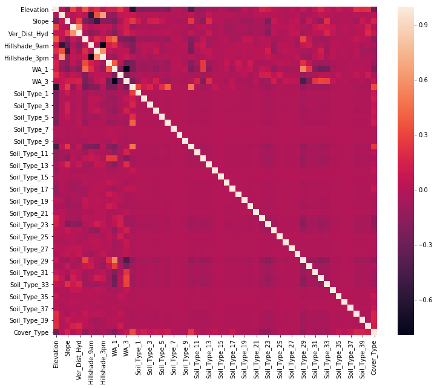


It looks like +/-0.7 is about the strongest correlation between any two variables. If it were 0.8, I would be worried about multicollinearity, but I don't think 0.7 poses a real problem. At any rate, the Principal Components Analysis I'll do later will remove any multicollinearity.

I suspect that not all of these features are useful for prediction (especially all those soil types). To test this, I will run a quick Random Forest model and look at the feature importances. If a number of features seem really unimportant for prediction, I can combine/eliminate them using Principal Components Analysis.


```python
# Get a random sample of observations for testing
quick_sample = df.sample(10000, random_state=1)
quick_sample_y = quick_sample['Cover_Type']
quick_sample_x = quick_sample.drop('Cover_Type', axis=1)

# Create and fit a Random Forest classifier to the quick sample data
trial_forest = RandomForestClassifier()
trial_forest.fit(quick_sample_x, quick_sample_y)
```

    RandomForestClassifier(bootstrap=True, class_weight=None, criterion='gini',
                max_depth=None, max_features='auto', max_leaf_nodes=None,
                min_impurity_decrease=0.0, min_impurity_split=None,
                min_samples_leaf=1, min_samples_split=2,
                min_weight_fraction_leaf=0.0, n_estimators=10, n_jobs=None,
                oob_score=False, random_state=None, verbose=0,
                warm_start=False)


```python
# Visualize the feature importances from the Random Forest trial
print(trial_forest.score(quick_sample_x, quick_sample_y))
n_features = quick_sample_x.shape[1]
plt.figure(figsize=(8,10))
plt.barh(range(n_features), trial_forest.feature_importances_, align='center') 
plt.yticks(np.arange(n_features), quick_sample_x.columns) 
plt.xlabel("Feature importance")
plt.ylabel("Feature (Component)")
plt.title('Feature Importances');
```

    0.9893


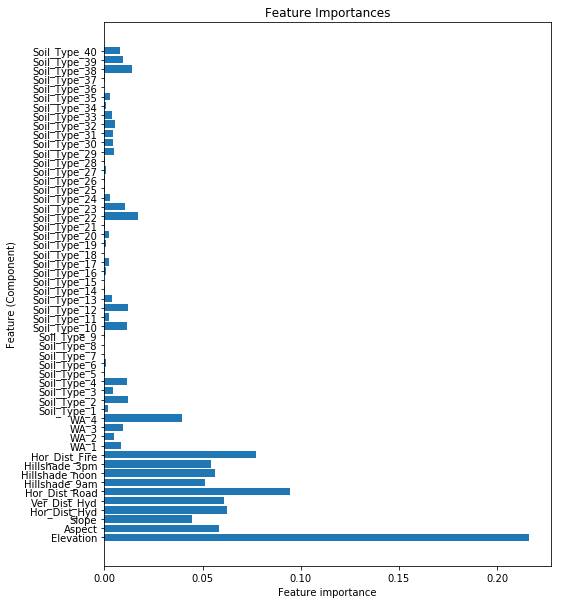


Judging by this quick-and-dirty analysis, there may be about 13-14 features (all of them soil types) that have little importance for prediction. Rather than identify and eliminate them manually, I will use Principal Components Analysis (below) to reduce the dimensions of the dataset to 40.

# Preprocessing

In this section I manipulate the data to prepare it for modeling. There are three main steps I want to take:

* Splitting the data into a training set, a validation set (to help me develop my models), and a test set (to help me evaluate the final version of each model);

* Resampling the training set so that all classes are equally represented;

* Scaling the data, which will help ensure that PCA and some machine learning algorithms work properly;

* and Principal Components Analysis (PCA), which will reduce the dimensions of the data and eliminate any multicollinearity.

I do all these steps first to the training data so that I can check the outcome at each step. Once that's done, I put the essential preprocessing steps into a pipeline that I can use to transform the validation and test sets.

## Train-validation-test split

First up is the train-test split. Note that I am actually making two splits. First, I take 80% of the total dataset to use as my training data. Then I take the remaining 20% of the original dataset and devote half of that to validation and half to be used as a true holdout set, which I will only use to evaluate the final versions of each of my models.

Note also that I am doing stratified splits so that each subset will contain all the classes in the same proportions as in the original dataset.


```python
# Split first into training and test datasets
y = df['Cover_Type']
X = df.drop('Cover_Type', axis=1)

X_train, X_test, y_train, y_test = train_test_split(X, y, test_size=0.2,
                                                    random_state=1,
                                                    stratify=y)
```


```python
# Split again into validation and true holdout (test) datasets
X_val, X_test, y_val, y_test = train_test_split(X_test, y_test, test_size=0.5,
                                                random_state=1,
                                                stratify=y_test)
```


```python
# Examine shapes of the subsets
print(X_train.shape, y_train.shape)
print(X_val.shape, y_val.shape)
print(X_test.shape, y_test.shape)
```

    (464809, 54) (464809,)  
    (58101, 54) (58101,)  
    (58102, 54) (58102,)


I know that later I will want to compare model performance on the raw data and the preprocessed version, so at this point (before preprocessing) I will save copies for later.


```python
# Save raw copies of train and validation sets before further preprocessing
X_train_raw = X_train.copy()
y_train_raw = y_train.copy()

X_val_raw = X_val.copy()
y_val_raw = y_val.copy()
```

## Resampling

My next preprocessing step is to deal with the class imbalance. My overall strategy is to undersample the bigger classes and oversample the smaller ones so that every class is the same size as the median-sized class.

First, I'll put the training data back into one DataFrame to make things a little easier.


```python
# Concatenate X_train and y_train for resampling
df_train = pd.concat([X_train, y_train], axis=1)
print(len(df_train))
df_train.head()
```

    464809


<div>
<style scoped>
    .dataframe tbody tr th:only-of-type {
        vertical-align: middle;
    }

    .dataframe tbody tr th {
        vertical-align: top;
    }

    .dataframe thead th {
        text-align: right;
    }
</style>
<table border="1" class="dataframe">
  <thead>
    <tr style="text-align: right;">
      <th></th>
      <th>Elevation</th>
      <th>Aspect</th>
      <th>Slope</th>
      <th>Hor_Dist_Hyd</th>
      <th>Ver_Dist_Hyd</th>
      <th>Hor_Dist_Road</th>
      <th>Hillshade_9am</th>
      <th>Hillshade_noon</th>
      <th>Hillshade_3pm</th>
      <th>Hor_Dist_Fire</th>
      <th>...</th>
      <th>Soil_Type_32</th>
      <th>Soil_Type_33</th>
      <th>Soil_Type_34</th>
      <th>Soil_Type_35</th>
      <th>Soil_Type_36</th>
      <th>Soil_Type_37</th>
      <th>Soil_Type_38</th>
      <th>Soil_Type_39</th>
      <th>Soil_Type_40</th>
      <th>Cover_Type</th>
    </tr>
  </thead>
  <tbody>
    <tr>
      <td>450015</td>
      <td>3250</td>
      <td>35</td>
      <td>4</td>
      <td>534</td>
      <td>212</td>
      <td>2969</td>
      <td>219</td>
      <td>231</td>
      <td>148</td>
      <td>3161</td>
      <td>...</td>
      <td>0</td>
      <td>0</td>
      <td>0</td>
      <td>0</td>
      <td>0</td>
      <td>0</td>
      <td>0</td>
      <td>0</td>
      <td>0</td>
      <td>1</td>
    </tr>
    <tr>
      <td>127010</td>
      <td>2580</td>
      <td>61</td>
      <td>20</td>
      <td>30</td>
      <td>-1</td>
      <td>1061</td>
      <td>232</td>
      <td>193</td>
      <td>85</td>
      <td>553</td>
      <td>...</td>
      <td>0</td>
      <td>0</td>
      <td>0</td>
      <td>0</td>
      <td>0</td>
      <td>0</td>
      <td>0</td>
      <td>0</td>
      <td>0</td>
      <td>1</td>
    </tr>
    <tr>
      <td>247694</td>
      <td>2216</td>
      <td>41</td>
      <td>38</td>
      <td>384</td>
      <td>251</td>
      <td>424</td>
      <td>194</td>
      <td>129</td>
      <td>40</td>
      <td>295</td>
      <td>...</td>
      <td>0</td>
      <td>0</td>
      <td>0</td>
      <td>0</td>
      <td>0</td>
      <td>0</td>
      <td>0</td>
      <td>0</td>
      <td>0</td>
      <td>3</td>
    </tr>
    <tr>
      <td>548749</td>
      <td>3166</td>
      <td>181</td>
      <td>17</td>
      <td>242</td>
      <td>61</td>
      <td>3252</td>
      <td>224</td>
      <td>248</td>
      <td>152</td>
      <td>630</td>
      <td>...</td>
      <td>0</td>
      <td>0</td>
      <td>1</td>
      <td>0</td>
      <td>0</td>
      <td>0</td>
      <td>0</td>
      <td>0</td>
      <td>0</td>
      <td>2</td>
    </tr>
    <tr>
      <td>29431</td>
      <td>2900</td>
      <td>296</td>
      <td>25</td>
      <td>210</td>
      <td>92</td>
      <td>5076</td>
      <td>142</td>
      <td>223</td>
      <td>218</td>
      <td>4763</td>
      <td>...</td>
      <td>0</td>
      <td>0</td>
      <td>0</td>
      <td>0</td>
      <td>0</td>
      <td>0</td>
      <td>0</td>
      <td>0</td>
      <td>0</td>
      <td>1</td>
    </tr>
  </tbody>
</table>
<p>5 rows × 55 columns</p>
</div>


Next, let's review the current counts of all the classes.


```python
# Check for class imbalance
df_train.Cover_Type.value_counts()
```


    2    226640  
    1    169472  
    3     28603  
    7     16408  
    6     13894  
    5      7594  
    4      2198  
    Name: Cover_Type, dtype: int64


Now I can use `RandomUnderSampler` and `SMOTE` to undersample the larger classes and oversample the smaller ones, aiming for every class to have 16,408 observations.


```python
# Randomly undersample the larger classes
rus = RandomUnderSampler(random_state=3, 
                         sampling_strategy={1:16408, 2:16408, 3:16408,})


X_rus, y_rus = rus.fit_resample(X_train, y_train)

# Check class counts
Counter(y_rus)
```


    Counter({1: 16408, 2: 16408, 3: 16408, 4: 2198, 5: 7594, 6: 13894, 7: 16408})


```python
# Randomly oversample the smaller classes
smote = SMOTE(random_state=3, sampling_strategy={4:16408, 5:16408, 6:16408})

X_resampled, y_resampled = smote.fit_resample(X_rus, y_rus)

# Check class counts
Counter(y_resampled)
```


    Counter({1: 16408, 2: 16408, 3: 16408, 4: 16408, 5: 16408, 6: 16408, 7: 16408})


The final count above shows that the classes are now balanced.

## Scaling

The next transformation I want to do is to standardize the features. This isn't required for Random Forests, but it is helpful for more complex algorithms like Support Vector Machines (plus it doesn't hurt Random Forests, so I may as well do it now).


```python
# Scale the features
scaler = StandardScaler()
X_scaled = scaler.fit_transform(X_resampled)
X_scaled = pd.DataFrame(X_scaled)
```


```python
# Check the results
X_scaled.describe()
```


<div>
<style scoped>
    .dataframe tbody tr th:only-of-type {
        vertical-align: middle;
    }

    .dataframe tbody tr th {
        vertical-align: top;
    }

    .dataframe thead th {
        text-align: right;
    }
</style>
<table border="1" class="dataframe">
  <thead>
    <tr style="text-align: right;">
      <th></th>
      <th>0</th>
      <th>1</th>
      <th>2</th>
      <th>3</th>
      <th>4</th>
      <th>5</th>
      <th>6</th>
      <th>7</th>
      <th>8</th>
      <th>9</th>
      <th>...</th>
      <th>44</th>
      <th>45</th>
      <th>46</th>
      <th>47</th>
      <th>48</th>
      <th>49</th>
      <th>50</th>
      <th>51</th>
      <th>52</th>
      <th>53</th>
    </tr>
  </thead>
  <tbody>
    <tr>
      <td>count</td>
      <td>1.148560e+05</td>
      <td>1.148560e+05</td>
      <td>1.148560e+05</td>
      <td>1.148560e+05</td>
      <td>1.148560e+05</td>
      <td>1.148560e+05</td>
      <td>1.148560e+05</td>
      <td>1.148560e+05</td>
      <td>1.148560e+05</td>
      <td>1.148560e+05</td>
      <td>...</td>
      <td>1.148560e+05</td>
      <td>1.148560e+05</td>
      <td>1.148560e+05</td>
      <td>1.148560e+05</td>
      <td>1.148560e+05</td>
      <td>1.148560e+05</td>
      <td>1.148560e+05</td>
      <td>1.148560e+05</td>
      <td>1.148560e+05</td>
      <td>1.148560e+05</td>
    </tr>
    <tr>
      <td>mean</td>
      <td>2.133063e-16</td>
      <td>-3.402508e-18</td>
      <td>1.299140e-17</td>
      <td>-1.899218e-17</td>
      <td>-2.822535e-17</td>
      <td>5.765705e-17</td>
      <td>3.554693e-16</td>
      <td>-5.596817e-16</td>
      <td>2.417637e-16</td>
      <td>-3.315899e-17</td>
      <td>...</td>
      <td>-4.008774e-17</td>
      <td>5.416175e-17</td>
      <td>3.552528e-17</td>
      <td>1.082616e-19</td>
      <td>-3.181345e-17</td>
      <td>-8.966383e-18</td>
      <td>2.056971e-17</td>
      <td>7.497891e-17</td>
      <td>-4.751139e-17</td>
      <td>3.136494e-17</td>
    </tr>
    <tr>
      <td>std</td>
      <td>1.000004e+00</td>
      <td>1.000004e+00</td>
      <td>1.000004e+00</td>
      <td>1.000004e+00</td>
      <td>1.000004e+00</td>
      <td>1.000004e+00</td>
      <td>1.000004e+00</td>
      <td>1.000004e+00</td>
      <td>1.000004e+00</td>
      <td>1.000004e+00</td>
      <td>...</td>
      <td>1.000004e+00</td>
      <td>1.000004e+00</td>
      <td>1.000004e+00</td>
      <td>1.000004e+00</td>
      <td>1.000004e+00</td>
      <td>1.000004e+00</td>
      <td>1.000004e+00</td>
      <td>1.000004e+00</td>
      <td>1.000004e+00</td>
      <td>1.000004e+00</td>
    </tr>
    <tr>
      <td>min</td>
      <td>-2.120858e+00</td>
      <td>-1.423987e+00</td>
      <td>-1.962208e+00</td>
      <td>-1.090620e+00</td>
      <td>-3.324786e+00</td>
      <td>-1.287201e+00</td>
      <td>-6.938578e+00</td>
      <td>-7.290815e+00</td>
      <td>-2.908838e+00</td>
      <td>-1.375326e+00</td>
      <td>...</td>
      <td>-1.454026e-01</td>
      <td>-2.144755e-01</td>
      <td>-2.075198e-01</td>
      <td>-4.113307e-02</td>
      <td>-8.485013e-02</td>
      <td>-2.107680e-02</td>
      <td>-4.489173e-02</td>
      <td>-2.248845e-01</td>
      <td>-2.157161e-01</td>
      <td>-1.715900e-01</td>
    </tr>
    <tr>
      <td>25%</td>
      <td>-8.945149e-01</td>
      <td>-8.318577e-01</td>
      <td>-7.743657e-01</td>
      <td>-7.708600e-01</td>
      <td>-7.533096e-01</td>
      <td>-7.230251e-01</td>
      <td>-5.451907e-01</td>
      <td>-5.145001e-01</td>
      <td>-6.167281e-01</td>
      <td>-7.093079e-01</td>
      <td>...</td>
      <td>-1.454026e-01</td>
      <td>-2.144755e-01</td>
      <td>-2.075198e-01</td>
      <td>-4.113307e-02</td>
      <td>-8.485013e-02</td>
      <td>-2.107680e-02</td>
      <td>-4.489173e-02</td>
      <td>-2.248845e-01</td>
      <td>-2.157161e-01</td>
      <td>-1.715900e-01</td>
    </tr>
    <tr>
      <td>50%</td>
      <td>1.014521e-02</td>
      <td>-2.852769e-01</td>
      <td>-1.804444e-01</td>
      <td>-2.315627e-01</td>
      <td>-3.110812e-01</td>
      <td>-3.030859e-01</td>
      <td>2.376729e-01</td>
      <td>1.455306e-01</td>
      <td>7.522952e-02</td>
      <td>-2.251362e-01</td>
      <td>...</td>
      <td>-1.454026e-01</td>
      <td>-2.144755e-01</td>
      <td>-2.075198e-01</td>
      <td>-4.113307e-02</td>
      <td>-8.485013e-02</td>
      <td>-2.107680e-02</td>
      <td>-4.489173e-02</td>
      <td>-2.248845e-01</td>
      <td>-2.157161e-01</td>
      <td>-1.715900e-01</td>
    </tr>
    <tr>
      <td>75%</td>
      <td>8.544149e-01</td>
      <td>9.354203e-01</td>
      <td>6.510454e-01</td>
      <td>4.843186e-01</td>
      <td>4.587237e-01</td>
      <td>4.271125e-01</td>
      <td>7.595821e-01</td>
      <td>7.175571e-01</td>
      <td>7.023161e-01</td>
      <td>4.305037e-01</td>
      <td>...</td>
      <td>-1.454026e-01</td>
      <td>-2.144755e-01</td>
      <td>-2.075198e-01</td>
      <td>-4.113307e-02</td>
      <td>-8.485013e-02</td>
      <td>-2.107680e-02</td>
      <td>-4.489173e-02</td>
      <td>-2.248845e-01</td>
      <td>-2.157161e-01</td>
      <td>-1.715900e-01</td>
    </tr>
    <tr>
      <td>max</td>
      <td>2.655364e+00</td>
      <td>1.855498e+00</td>
      <td>5.283631e+00</td>
      <td>5.509806e+00</td>
      <td>8.975714e+00</td>
      <td>4.036787e+00</td>
      <td>1.346730e+00</td>
      <td>1.553596e+00</td>
      <td>2.561952e+00</td>
      <td>4.988848e+00</td>
      <td>...</td>
      <td>6.877457e+00</td>
      <td>4.662538e+00</td>
      <td>4.818818e+00</td>
      <td>2.431134e+01</td>
      <td>1.178549e+01</td>
      <td>4.744553e+01</td>
      <td>2.227582e+01</td>
      <td>4.446727e+00</td>
      <td>4.635722e+00</td>
      <td>5.827845e+00</td>
    </tr>
  </tbody>
</table>
<p>8 rows × 54 columns</p>
</div>


The features have now been standardized so that they all have a mean of 0 and a standard deviation of 1.

Let's just get a quick visual confirmation of this change with some histograms.


```python
# Visualize the distributions again
X_scaled.loc[:,:9].hist(figsize=(16, 12));
```


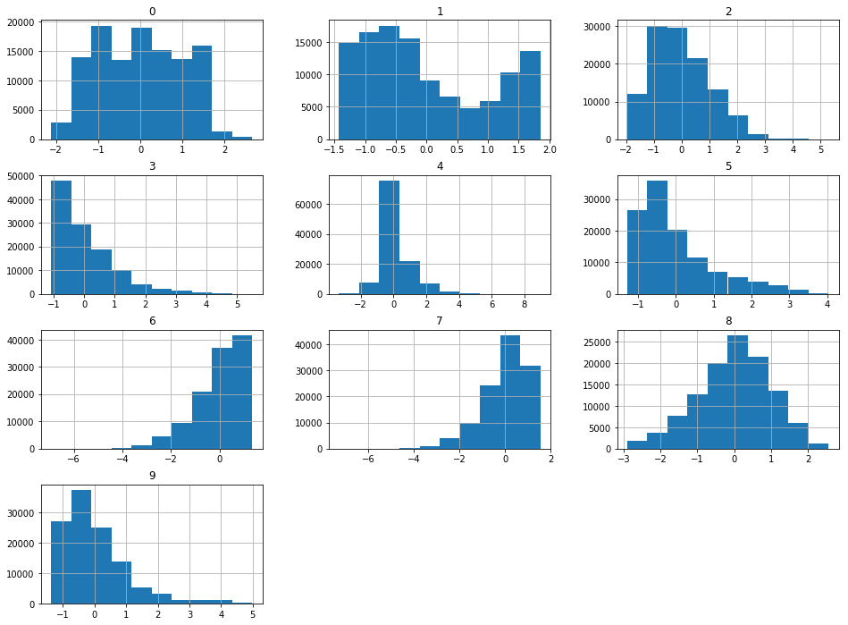


Now that the training data has been scaled, I can move on to PCA.

## PCA

Principal Components Analysis takes the features we have and tries to combine them in ways that maximize the amount of variance the components can explain in the data. For datasets like the one I'm working with here, where there are lots of features, PCA can help us avoid the negative effects of having numerous features while still allowing us to account for as much variance as possible. For my analysis below, I aim to find a number of components that will explain at least 80% of the variance in the data.

First, let's see how much variance we can explain with a wide range of components. If any of these look promising, we can drill down further.


```python
# Try several numbers of components to explain 80% of variance
comps = [10, 15, 20, 25, 30, 35, 40, 45, 50, 54]
var_sums = []
for comp in comps:
    pca = PCA(n_components=comp)
    pca.fit_transform(X_scaled)
    var_sums.append(np.sum(pca.explained_variance_ratio_))
    
# Visualize results
plt.figure(figsize=(10,8))
plt.plot(comps, var_sums)
plt.xlabel('Number of components')
plt.ylabel('% of variance explained')
plt.title('Variance explained by n components')
plt.xticks([10, 15, 20, 25, 30, 35, 40, 45, 50, 54])
plt.show();
```


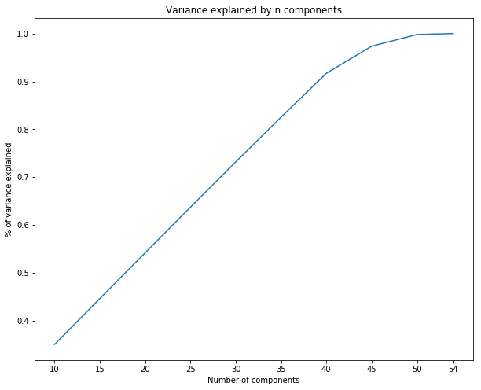


Forty components seem to capture about 90% of the variance in the data, which aligns with what we expected based on the feature importances plot above.

Let's check the specifics:


```python
# View the % variance explained for each number of components
display(list(zip(comps, var_sums)))
```


    [(10, 0.35010888736308404),  
     (15, 0.44608664619583926),  
     (20, 0.5417110272036322),  
     (25, 0.6371728315459847),  
     (30, 0.731738065646417),  
     (35, 0.8253686829453852),  
     (40, 0.917027514295714),  
     (45, 0.9736568637688149),  
     (50, 0.9979901475164933),  
     (54, 1.0)]


From the plot and the list above, it's clear that we could explain over 90% of the variance in the data with 40 components (out of a possible 54). Using fewer features/components will help us avoid overfitting on the training data, but at the expense of a little bit of accuracy. I think it's a worthwhile trade.

## Preprocessing pipeline

I know that I want to transform my data so that it is standardized and has 40 components. I will use a pipeline to do this so that I can easily transform my validation and test sets in the same way as my training set without leaking data from one set to another.


```python
# Build a pipeline for the preprocessing steps
pipe_prepro = Pipeline([('scaler', StandardScaler()),
                        ('pca', PCA(n_components=40))])
```

I will fit the preprocessing pipeline to the training data (which has been resampled), then use the pipeline to transform the validation and test sets separately.


```python
# Fit the pipeline and transform the training dataset
X_train_trans = pipe_prepro.fit_transform(X_resampled)
```

```python
# Use the pipeline to transform the validation and test datasets
X_val_trans = pipe_prepro.transform(X_val)
X_test_trans = pipe_prepro.transform(X_test)
```


This transformation will form part of the final pipeline, but by transforming the data now, I can more easily use it to build and evaluate my models.

Finally, I'll just make a copy of my un-preprocessed training labels and give the copy a more convenient name.


```python
# Apply naming conventions to the un-preprocessed labels
y_train_res = y_resampled.copy()
```

# Testing various algorithms

In the sections that follow I will explore three different algorithms to find one that can classify land tracts by their type of tree cover with the highest accuracy. 

**Random Forest** classifiers use a number of Decision Trees to predict labels for observations. 

**XGBoost** is an ensemble method that trains a series of weak learners to work in sequence to predict labels. This is typically considered a more flexible and powerful type of algorithm than a Random Forest.

**Support Vector Machines** predict labels by drawing decision boundaries between data points in multi-dimensional space. This is considered a very powerful type of classifier, so I'm looking forward to seeing how it performs.

## Random Forest 1

To establish a baseline for all the other models, the first model will be a Random Forest trained on observations that have been class-balanced but not scaled or transformed with PCA.

### Baseline model

First I will instantiate a Random Forest classifier with default parameters, fit it to the training data, and take a look at the accuracy score, confusion matrix, and classification report to see how it performed.


```python
# Fit and score a baseline RandomForestClassifier
forest1 = RandomForestClassifier()
forest1.fit(X_resampled, y_resampled)

train_pred = forest1.predict(X_resampled)

print_metrics(y_resampled, train_pred)
```


    Accuracy: 0.9975795779062478  
    -------  
    Confusion matrix:  
    [[16370    28     0     0     2     0     8]  
     [  116 16269     5     0     9     7     2]  
     [    0     1 16384     4     0    19     0]  
     [    0     0     5 16403     0     0     0]  
     [    0     6     1     0 16401     0     0]  
     [    0     0    43    15     1 16349     0]  
     [    6     0     0     0     0     0 16402]]  
    -------  
    Classification report:  
                  precision    recall  f1-score   support  
    
               1       0.99      1.00      1.00     16408  
               2       1.00      0.99      0.99     16408  
               3       1.00      1.00      1.00     16408  
               4       1.00      1.00      1.00     16408  
               5       1.00      1.00      1.00     16408  
               6       1.00      1.00      1.00     16408  
               7       1.00      1.00      1.00     16408  
    
       micro avg       1.00      1.00      1.00    114856  
       macro avg       1.00      1.00      1.00    114856  
    weighted avg       1.00      1.00      1.00    114856  
    


That's an outstanding accuracy score&mdash;and it probably means that the model is overfitting on the training data a bit. 


```python
# Validate
val_pred = forest1.predict(X_val_raw)

print_metrics(y_val_raw, val_pred)
```

    Accuracy: 0.8475929846302129  
    -------  
    Confusion matrix:  
    [[18596  1955    13     0   112    26   482]  
     [ 4053 22560   403     1   766   460    87]  
     [    0    14  3315    37     6   203     0]  
     [    0     0    17   255     0     3     0]  
     [    1    24    16     0   901     8     0]  
     [    2     8   110    13     4  1599     0]  
     [   28     2     0     0     1     0  2020]]  
    -------  
    Classification report:  
                  precision    recall  f1-score   support  
    
               1       0.82      0.88      0.85     21184 
               2       0.92      0.80      0.85     28330  
               3       0.86      0.93      0.89      3575  
               4       0.83      0.93      0.88       275  
               5       0.50      0.95      0.66       950  
               6       0.70      0.92      0.79      1736  
               7       0.78      0.98      0.87      2051  
    
       micro avg       0.85      0.85      0.85     58101  
       macro avg       0.77      0.91      0.83     58101  
    weighted avg       0.86      0.85      0.85     58101  
    


I'm honestly surprised the model performed this well on the validation data, but it looks like this Random Forest is actually very good at predicting labels for the raw observations.

Next let's see how trying other parameters (not just the defaults) for the Random Forest affects performance.

### Tune parameters with GridSearchCV

A grid search will let me try every possible combination of the parameter values I supply. GridSearchCV performs 3-fold cross-validation on each combination and returns the one that performed the best on average.

For my parameter values, I'm trying 10 v. 100 decision trees; a selection of 30, 40, or all 54 features; and a tree depth of 20 v. 25. Grid searches tend to take a long time to run, so if you're trying to run this code on your own machine, be warned it may take a while!


```python
# Use GridSearchCV to find best parameters for the Random Forest
params = {'n_estimators': [10, 100],
          'max_features': [30, 40, 54],
          'max_depth': [20, 25]}

grid_forest1 = GridSearchCV(forest1, params, cv=3, n_jobs=-1)

grid_forest1.fit(X_resampled, y_resampled)
```


    GridSearchCV(cv=3, error_score='raise-deprecating',
           estimator=RandomForestClassifier(bootstrap=True, class_weight=None, criterion='gini',
                max_depth=None, max_features='auto', max_leaf_nodes=None,
                min_impurity_decrease=0.0, min_impurity_split=None,
                min_samples_leaf=1, min_samples_split=2,
                min_weight_fraction_leaf=0.0, n_estimators=10, n_jobs=None,
                oob_score=False, random_state=None, verbose=0,
                warm_start=False),
           fit_params=None, iid='warn', n_jobs=-1,
           param_grid={'n_estimators': [10, 100], 'max_features': [30, 40, 54], 'max_depth': [20, 25]},
           pre_dispatch='2*n_jobs', refit=True, return_train_score='warn',
           scoring=None, verbose=0)


```python
# View best score and parameters
print('Best score:', grid_forest1.best_score_)
print('Best params:', grid_forest1.best_params_)
```

    Best score: 0.9378700285574981  
    Best params: {'max_depth': 25, 'max_features': 30, 'n_estimators': 100}


The best option found by the grid search had an accuracy score of 93.8% with the parameters listed above.

Now let's examine how the best Random Forest model performs when predicting on the training, validation, and test datasets.


```python
# View training metrics for the best model
y_pred = grid_forest1.predict(X_resampled)
print_metrics(y_resampled, y_pred)
```

    Accuracy: 0.9975708713519538  
    -------  
    Confusion matrix:  
    [[16362     0     0     0    45     0     1]  
     [    8 16203     0     0   191     6     0]  
     [    0     0 16391     8     2     7     0]  
     [    0     0     0 16408     0     0     0]  
     [    0     0     0     0 16408     0     0]  
     [    0     0     0     6     4 16398     0]  
     [    1     0     0     0     0     0 16407]]  
    -------  
    Classification report:  
                  precision    recall  f1-score   support  
    
               1       1.00      1.00      1.00     16408  
               2       1.00      0.99      0.99     16408  
               3       1.00      1.00      1.00     16408  
               4       1.00      1.00      1.00     16408  
               5       0.99      1.00      0.99     16408  
               6       1.00      1.00      1.00     16408  
               7       1.00      1.00      1.00     16408  
    
       micro avg       1.00      1.00      1.00    114856  
       macro avg       1.00      1.00      1.00    114856  
    weighted avg       1.00      1.00      1.00    114856  
    


```python
# View validation metrics for the best model
y_pred = grid_forest1.predict(X_val_raw)
print_metrics(y_val_raw, y_pred)
```

    Accuracy: 0.8862670177793842  
    -------  
    Confusion matrix:  
    [[18923  1627     7     0   169    21   437]  
     [ 2306 24282   326     0   963   373    80]  
     [    0    11  3403    30    10   121     0]  
     [    0     0    13   257     0     5     0]  
     [    0     7    12     0   927     4     0]  
     [    0     2    52     9     7  1666     0]  
     [   13     2     0     0     1     0  2035]]  
    -------  
    Classification report:  
                  precision    recall  f1-score   support  
    
               1       0.89      0.89      0.89     21184  
               2       0.94      0.86      0.90     28330  
               3       0.89      0.95      0.92      3575  
               4       0.87      0.93      0.90       275  
               5       0.45      0.98      0.61       950  
               6       0.76      0.96      0.85      1736  
               7       0.80      0.99      0.88      2051  
    
       micro avg       0.89      0.89      0.89     58101  
       macro avg       0.80      0.94      0.85     58101  
    weighted avg       0.90      0.89      0.89     58101  
    


The optimized Random Forest scored 88.6% on the validation set. The confusion matrix and classification report show that the model had its worst F1 score for class 5; it seems to be having trouble catching all the instances of that class. We can compare subsequent models to see if any do better at catching that class.

### Evaluating the best (unpreprocessed) Random Forest classifier

So that I don't have to rerun the time-consuming algorithms above, I'll create a pipeline that contains just the model I want, fit it to the raw training data, and then extract predictions for the validation and test sets. This is the first time the model will encounter the test set, so now we'll see how it might perform on unseen data going forward.


```python
# Create and fit the model pipeline
pipe_forest1 = Pipeline([('forest1', RandomForestClassifier(max_depth=25,
                                                            max_features=30,
                                                            n_estimators=100))
                        ])

pipe_forest1.fit(X_resampled, y_resampled)
```


    Pipeline(memory=None,
         steps=[('forest1', RandomForestClassifier(bootstrap=True, class_weight=None, criterion='gini',
                max_depth=25, max_features=30, max_leaf_nodes=None,
                min_impurity_decrease=0.0, min_impurity_split=None,
                min_samples_leaf=1, min_samples_split=2,
                min_weight_fraction_leaf=0.0, n_estimators=100, n_jobs=None,
                oob_score=False, random_state=None, verbose=0,
                warm_start=False))])


```python
# View metrics for training data
y_pred = pipe_forest1.predict(X_resampled)
print_metrics(y_resampled, y_pred)
```

    Accuracy: 0.9972748485059553  
    -------  
    Confusion matrix:  
    [[16358     0     0     0    50     0     0]  
     [   20 16173     1     0   205     9     0]  
     [    0     0 16394     5     5     4     0]  
     [    0     0     0 16408     0     0     0]  
     [    0     0     0     0 16408     0     0]  
     [    0     0     0     6     6 16396     0]  
     [    0     0     0     0     2     0 16406]]  
    -------  
    Classification report:  
                  precision    recall  f1-score   support  
    
               1       1.00      1.00      1.00     16408  
               2       1.00      0.99      0.99     16408  
               3       1.00      1.00      1.00     16408  
               4       1.00      1.00      1.00     16408  
               5       0.98      1.00      0.99     16408  
               6       1.00      1.00      1.00     16408  
               7       1.00      1.00      1.00     16408  
    
       micro avg       1.00      1.00      1.00    114856  
       macro avg       1.00      1.00      1.00    114856  
    weighted avg       1.00      1.00      1.00    114856  
    


```python
# View metrics for validation data
y_pred = pipe_forest1.predict(X_val_raw)
print_metrics(y_val_raw, y_pred)
```

    Accuracy: 0.8867489371955732  
    -------  
    Confusion matrix:  
    [[18979  1579     7     0   177    20   422]  
     [ 2285 24255   325     0  1004   380    81]  
     [    0    10  3402    35    11   117     0]  
     [    0     0    13   258     0     4     0]  
     [    0    10    12     0   924     4     0]  
     [    0     2    53     8     6  1667     0]  
     [   13     1     0     0     1     0  2036]]  
    -------  
    Classification report:  
                  precision    recall  f1-score   support  
    
               1       0.89      0.90      0.89     21184  
               2       0.94      0.86      0.90     28330  
               3       0.89      0.95      0.92      3575  
               4       0.86      0.94      0.90       275  
               5       0.44      0.97      0.60       950  
               6       0.76      0.96      0.85      1736  
               7       0.80      0.99      0.89      2051  
    
       micro avg       0.89      0.89      0.89     58101  
       macro avg       0.80      0.94      0.85     58101  
    weighted avg       0.90      0.89      0.89     58101  
    


```python
# View metrics for test data
y_pred_test_forest1 = pipe_forest1.predict(X_test)
print_metrics(y_test, y_pred_test_forest1)
```

    Accuracy: 0.8845306529895701  
    -------  
    Confusion matrix:  
    [[18901  1677     3     0   169    20   414]  
     [ 2365 24191   357     0   982   360    76]  
     [    0    10  3394    39     8   125     0]  
     [    0     0    17   252     0     5     0]  
     [    0     6     4     0   938     1     0]  
     [    0     2    44    10     5  1676     0]  
     [   10     0     0     0     0     0  2041]]  
    -------  
    Classification report:  
                  precision    recall  f1-score   support  
    
               1       0.89      0.89      0.89     21184  
               2       0.93      0.85      0.89     28331  
               3       0.89      0.95      0.92      3576  
               4       0.84      0.92      0.88       274  
               5       0.45      0.99      0.61       949  
               6       0.77      0.96      0.85      1737  
               7       0.81      1.00      0.89      2051  
    
       micro avg       0.88      0.88      0.88     58102  
       macro avg       0.80      0.94      0.85     58102  
    weighted avg       0.90      0.88      0.89     58102  
    


```python
# Plot ROC curve for each class
roc_it(y_test, y_pred_test_forest1, 'Random Forest 1')
```


The model's performance on the test dataset is very close to its performance on the validation and training sets, leading me to believe that the model is not overfitting on the training data. Class 5 is still the one where the model doesn't perform as well, but for every other class, performance is pretty good.

One last step to save me time in the future is to "pickle" this model, i.e., save a copy of the model that is already trained and ready to use for prediction.


```python
# Pickle the model
with open('forest1.pickle', 'wb') as f:
    pickle.dump(pipe_forest1, f, pickle.HIGHEST_PROTOCOL)
```

## Random Forest 2

It's hard to imagine that another model will perform as well as the baseline one above, so from here onward, I'll be looking to see how performance changes for each model. My hope is that I can find another model that performs well where the first one doesn't. This will give me options for predicting under different circumstances or with slightly different goals. 

This second Random Forest model uses data that has been transformed through scaling (using z-score standardization) and Principal Components Analysis.

### Baseline model

First I'll fit a baseline model to see how a Random Forest performs on the transformed data.


```python
# Fit and score a baseline RandomForestClassifier
forest2 = RandomForestClassifier()
forest2.fit(X_train_trans, y_train_res)
```

    /usr/local/lib/python3.6/dist-packages/sklearn/ensemble/forest.py:245: FutureWarning: The default value of n_estimators will change from 10 in version 0.20 to 100 in 0.22.
      "10 in version 0.20 to 100 in 0.22.", FutureWarning)


    RandomForestClassifier(bootstrap=True, class_weight=None, criterion='gini',
                           max_depth=None, max_features='auto', max_leaf_nodes=None,
                           min_impurity_decrease=0.0, min_impurity_split=None,
                           min_samples_leaf=1, min_samples_split=2,
                           min_weight_fraction_leaf=0.0, n_estimators=10,
                           n_jobs=None, oob_score=False, random_state=None,
                           verbose=0, warm_start=False)


```python
# Evaluate
y_pred = forest2.predict(X_train_trans)
print_metrics(y_train_res, y_pred)
```

    Accuracy: 0.996395486522254  
    -------  
    Confusion matrix:  
    [[16335    42     1     0     3     2    25]  
     [  123 16240    12     0    17    12     4]  
     [    0     1 16378     6     1    22     0]  
     [    0     0     5 16401     0     2     0]  
     [    2    16     3     0 16386     1     0]  
     [    1     1    62    26     6 16312     0]  
     [   14     4     0     0     0     0 16390]]  
    -------  
    Classification report:  
                  precision    recall  f1-score   support  
    
               1       0.99      1.00      0.99     16408  
               2       1.00      0.99      0.99     16408  
               3       0.99      1.00      1.00     16408  
               4       1.00      1.00      1.00     16408  
               5       1.00      1.00      1.00     16408  
               6       1.00      0.99      1.00     16408  
               7       1.00      1.00      1.00     16408  
    
        accuracy                           1.00    114856  
       macro avg       1.00      1.00      1.00    114856  
    weighted avg       1.00      1.00      1.00    114856  
    


Accuracy is still really high for the training data, which makes sense. In theory, scaling and PCA should not have much impact on a Random Forest model.


```python
# Validate 
y_pred = forest2.predict(X_val_trans)
print_metrics(y_val, y_pred)
```

    Accuracy: 0.8231183628508976  
    -------  
    Confusion matrix:  
    [[18073  2301    15     0   143    40   612]  
     [ 4505 21783   510    12   859   552   109]  
     [    2    23  3288    41     9   212     0]  
     [    0     0    16   248     0    11     0]  
     [   13    40    16     0   872     9     0]  
     [    2    14   141    14     4  1561     0]  
     [   47     4     0     0     1     0  1999]]  
    -------  
    Classification report:  
                  precision    recall  f1-score   support  
    
               1       0.80      0.85      0.82     21184  
               2       0.90      0.77      0.83     28330  
               3       0.82      0.92      0.87      3575  
               4       0.79      0.90      0.84       275  
               5       0.46      0.92      0.61       950  
               6       0.65      0.90      0.76      1736  
               7       0.73      0.97      0.84      2051  
    
        accuracy                           0.82     58101  
       macro avg       0.74      0.89      0.80     58101  
    weighted avg       0.84      0.82      0.83     58101  
    


The Random Forest scored over 99% accuracy on the training set and 82% on the validation set! The Random Forest is probably overfit to the training data. Below I'll use a grid search to see if there are other parameters that would help the Random Forest perform better on the validation set.

For now, let's take a look at the importance the Random Forest assigned to each of the 40 components.


```python
# Check the feature importances
forest2.feature_importances_
```


    array([0.08246777, 0.0129423 , 0.02055541, 0.01996136, 0.01798352,  
           0.01533155, 0.04323785, 0.02456184, 0.03054897, 0.0221972 ,  
           0.02375608, 0.02463589, 0.0265743 , 0.02289252, 0.02833921,  
           0.01738256, 0.02032123, 0.03013794, 0.02742376, 0.02452776,  
           0.02466996, 0.02485073, 0.02385575, 0.01269406, 0.02786883,  
           0.03020926, 0.02360446, 0.02773516, 0.02613266, 0.01750695,  
           0.01378035, 0.02584689, 0.01785867, 0.018686  , 0.02428663,  
           0.02286449, 0.04776844, 0.01385219, 0.03033672, 0.00981279])  


```python
# Visualize feature importances
plot_feature_importances(forest2, X_train_trans)
```


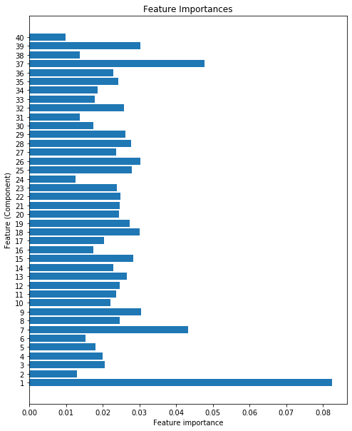


The plot above shows that there are a few features that are a bit more powerful than the rest. A grid search (below) will help me determine if a different maximum depth of tree or a different number of trees would improve performance.

### Tune parameters with GridSearchCV

In this grid search, I want to explore different options for the number of features to use for prediction, the maximum depth of each decision tree in the forest, and the minimum number of examples that each leaf must contain. Remember that GridSearchCV will be doing 3-fold cross-validation, for a total of 36 models to try.


```python
# Use GridSearchCV to find best parameters for the Random Forest
params = {'n_estimators': [100],
          'max_features': [20, 40],
          'max_depth': [20, 25],
          'min_samples_leaf': [5, 10, 20]}

grid_forest2 = GridSearchCV(forest2, params, cv=3, n_jobs=-1)

grid_forest2.fit(X_train_trans, y_train_res)
```


    GridSearchCV(cv=3, error_score='raise-deprecating',
                 estimator=RandomForestClassifier(bootstrap=True, class_weight=None,
                                                  criterion='gini', max_depth=None,
                                                  max_features='auto',
                                                  max_leaf_nodes=None,
                                                  min_impurity_decrease=0.0,
                                                  min_impurity_split=None,
                                                  min_samples_leaf=1,
                                                  min_samples_split=2,
                                                  min_weight_fraction_leaf=0.0,
                                                  n_estimators=10, n_jobs=None,
                                                  oob_score=False,
                                                  random_state=None, verbose=0,
                                                  warm_start=False),
                 iid='warn', n_jobs=-1,
                 param_grid={'max_depth': [20, 25], 'max_features': [20, 40],
                             'min_samples_leaf': [5, 10, 20],
                             'n_estimators': [100]},
                 pre_dispatch='2*n_jobs', refit=True, return_train_score=False,
                 scoring=None, verbose=0)


```python
# View best score and parameters
print('Best score:', grid_forest2.best_score_)
print('Best params:', grid_forest2.best_params_)
```

    Best score: 0.8972626593299435  
    Best params: {'max_depth': 25, 'max_features': 20, 'min_samples_leaf': 5, 'n_estimators': 100}


```python
# View the metrics for the best model
y_pred = grid_forest2.predict(X_train_trans)
print_metrics(y_train_res, y_pred)
```

    Accuracy: 0.9730009751340809  
    -------  
    Confusion matrix:  
    [[15566   473     8     0    79    23   259]  
     [  404 15314   194     3   266   187    40]  
     [    0    19 15878   142    23   346     0]  
     [    0     0    28 16368     0    12     0]  
     [    6    55    16     0 16305    26     0]  
     [    4    25   185   148    29 16017     0]  
     [   85    12     0     0     4     0 16307]]  
    -------  
    Classification report:  
                  precision    recall  f1-score   support  
    
               1       0.97      0.95      0.96     16408  
               2       0.96      0.93      0.95     16408  
               3       0.97      0.97      0.97     16408  
               4       0.98      1.00      0.99     16408  
               5       0.98      0.99      0.98     16408  
               6       0.96      0.98      0.97     16408  
               7       0.98      0.99      0.99     16408  
    
        accuracy                           0.97    114856  
       macro avg       0.97      0.97      0.97    114856  
    weighted avg       0.97      0.97      0.97    114856  
    


The best model discovered via grid search has a little less accuracy when predicting based on the training data, but hopefully that means less risk of it being overfit to the training data.


```python
# View the metrics for the best model
y_pred = grid_forest2.predict(X_val_trans)
print_metrics(y_val, y_pred)
```

    Accuracy: 0.8297103320080549  
    -------  
    Confusion matrix:  
    [[17746  2440    18     0   205    41   734]  
     [ 3432 22487   561    12  1101   615   122]  
     [    0    15  3226    58    12   264     0]  
     [    0     0    20   248     0     7     0]  
     [    6    27    15     0   889    13     0]  
     [    0    12   101    19     5  1599     0]  
     [   36     2     0     0     1     0  2012]]  
    -------  
    Classification report:  
                  precision    recall  f1-score   support  
    
               1       0.84      0.84      0.84     21184  
               2       0.90      0.79      0.84     28330  
               3       0.82      0.90      0.86      3575  
               4       0.74      0.90      0.81       275  
               5       0.40      0.94      0.56       950  
               6       0.63      0.92      0.75      1736  
               7       0.70      0.98      0.82      2051  
    
        accuracy                           0.83     58101  
       macro avg       0.72      0.90      0.78     58101  
    weighted avg       0.85      0.83      0.83     58101  
    


And there you have it: performance on the validation dataset has improved a little. This will be the model I evaluate using the holdout (test) dataset.

### Evaluating the best Random Forest classifier

Now that I have the parameters for the best version of my Random Forest model, I will build a pipeline to take raw data, transform it, and then make predictions on it.


```python
# Construct a pipeline for the best Random Forest model
pipe_forest2 = Pipeline([('scaler', StandardScaler()),
                         ('pca', PCA(n_components=40)),
                         ('forest2', RandomForestClassifier(max_depth=25,
                                                            max_features=20,
                                                            min_samples_leaf=5,
                                                            n_estimators=100))
                        ])
pipe_forest2.fit(X_resampled, y_resampled)
```


    Pipeline(memory=None,
         steps=[('scaler', StandardScaler(copy=True, with_mean=True, with_std=True)), ('pca', PCA(copy=True, iterated_power='auto', n_components=40, random_state=None,
      svd_solver='auto', tol=0.0, whiten=False)), ('forest2', RandomForestClassifier(bootstrap=True, class_weight=None, criterion='gini',
           ...obs=None,
                oob_score=False, random_state=None, verbose=0,
                warm_start=False))])


```python
# View metrics for the optimized model
y_pred = pipe_forest2.predict(X_resampled)
print_metrics(y_resampled, y_pred)
```


    Accuracy: 0.9724350491049663  
    -------  
    Confusion matrix:  
    [[15565   472     8     0    84    23   256]  
     [  398 15314   197     3   264   193    39]  
     [    0    21 15832   147    21   387     0]  
     [    0     0    28 16362     0    18     0]  
     [    5    56    16     0 16304    27     0]  
     [    4    21   191   152    32 16008     0]  
     [   87    13     0     0     3     0 16305]]  
    -------  
    Classification report:  
                  precision    recall  f1-score   support  
    
               1       0.97      0.95      0.96     16408  
               2       0.96      0.93      0.95     16408  
               3       0.97      0.96      0.97     16408  
               4       0.98      1.00      0.99     16408  
               5       0.98      0.99      0.98     16408  
               6       0.96      0.98      0.97     16408  
               7       0.98      0.99      0.99     16408  
    
       micro avg       0.97      0.97      0.97    114856  
       macro avg       0.97      0.97      0.97    114856  
    weighted avg       0.97      0.97      0.97    114856  
    


```python
# View the metrics for the best model
y_pred = pipe_forest2.predict(X_val)
print_metrics(y_val, y_pred)
```

    Accuracy: 0.8313626271492746  
    -------  
    Confusion matrix:  
    [[17803  2405    19     0   194    40   723]  
     [ 3420 22537   570    10  1074   603   116]  
     [    0    19  3213    60    13   270     0]  
     [    0     0    22   246     0     7     0]  
     [    6    29    15     0   887    13     0]  
     [    0    10    99    18     5  1604     0]  
     [   35     2     0     0     1     0  2013]]  
    -------  
    Classification report:  
                  precision    recall  f1-score   support  
    
               1       0.84      0.84      0.84     21184  
               2       0.90      0.80      0.85     28330  
               3       0.82      0.90      0.86      3575  
               4       0.74      0.89      0.81       275  
               5       0.41      0.93      0.57       950  
               6       0.63      0.92      0.75      1736  
               7       0.71      0.98      0.82      2051  
    
       micro avg       0.83      0.83      0.83     58101  
       macro avg       0.72      0.90      0.78     58101  
    weighted avg       0.85      0.83      0.84     58101  
    


This is the moment of truth: how well does this model perform on data it has never encountered before?


```python
# Evalutate performance on test data
y_pred_test_forest2 = pipe_forest2.predict(X_test)
print_metrics(y_test, y_pred_test_forest2)
```


    Accuracy: 0.8284740628549792  
    -------  
    Confusion matrix:  
    [[17683  2523    19     0   181    40   738]  
     [ 3542 22460   585    10  1017   586   131]  
     [    0    15  3233    75    11   242     0]  
     [    0     0    22   247     0     5     0]  
     [    5    33    12     0   896     3     0]  
     [    0    13    91    20     6  1607     0]  
     [   39     2     0     0     0     0  2010]]  
    -------  
    Classification report:  
                  precision    recall  f1-score   support  
    
               1       0.83      0.83      0.83     21184  
               2       0.90      0.79      0.84     28331  
               3       0.82      0.90      0.86      3576  
               4       0.70      0.90      0.79       274  
               5       0.42      0.94      0.59       949  
               6       0.65      0.93      0.76      1737  
               7       0.70      0.98      0.82      2051  
    
       micro avg       0.83      0.83      0.83     58102  
       macro avg       0.72      0.90      0.78     58102  
    weighted avg       0.84      0.83      0.83     58102  
    


```python
# Plot ROC curve for each class
roc_it(y_test, y_pred_test_forest2, 'Random Forest 2')
```


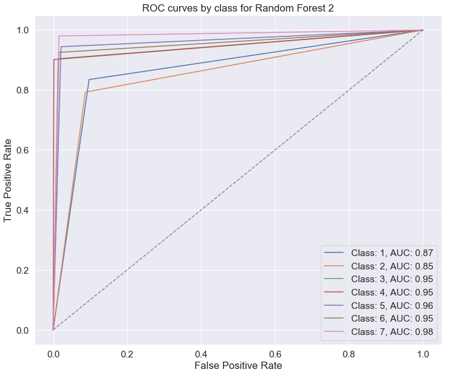


A test accuracy of 82.8% is very close to the validation accuracy of 83.1%, and a fair performance overall. This model is weakest at predicting classes 1 and 2, and it has the lowest precision for class 5. It will be interesting to see whether another model could pick up the slack.

I'll save a copy of the trained model for later.


```python
# Pickle the model
with open('forest2.pickle', 'wb') as f:
    pickle.dump(pipe_forest2, f, pickle.HIGHEST_PROTOCOL)
```

## XGBoost

XGBoost is an ensemble method that employs boosting, a technique where a series of weak learners is trained so that each tries to improve upon the performance of the one before it. Ensemble methods are known to be very powerful for classification tasks, so I'm eager to see how this one performs.

### Baseline model

For this first model, I'll be using `XGBClassifier()` with default parameters and training on data that has been class-balanced, scaled, and transformed with PCA.


```python
# Instantiate the classifier
xg = xgb.XGBClassifier()
```


```python
# Fit the classifier to the training data
xg.fit(X_train_trans, y_train_res)
```


    XGBClassifier(base_score=0.5, booster='gbtree', colsample_bylevel=1,
                  colsample_bynode=1, colsample_bytree=1, gamma=0,
                  learning_rate=0.1, max_delta_step=0, max_depth=3,
                  min_child_weight=1, missing=None, n_estimators=100, n_jobs=1,
                  nthread=None, objective='multi:softprob', random_state=0,
                  reg_alpha=0, reg_lambda=1, scale_pos_weight=1, seed=None,
                  silent=None, subsample=1, verbosity=1)


```python
# View metrics for the training data
y_pred = xg.predict(X_train_trans)

print_metrics(y_train_res, y_pred)
```

    Accuracy: 0.728294560144877  
    -------  
    Confusion matrix:  
    [[10107  3385     8     0  1033   156  1719]  
     [ 3980  8562   371    30  2561   769   135]  
     [    0    55 11149  1583   436  3185     0]  
     [    0     0   536 15393     2   477     0]  
     [  825  1497   550     0 13014   522     0]  
     [   69   215  3696  1045   940 10443     0]  
     [ 1095   193    12     0   127     0 14981]]  
    -------  
    Classification report:  
                  precision    recall  f1-score   support  
    
               1       0.63      0.62      0.62     16408  
               2       0.62      0.52      0.56     16408  
               3       0.68      0.68      0.68     16408  
               4       0.85      0.94      0.89     16408  
               5       0.72      0.79      0.75     16408  
               6       0.67      0.64      0.65     16408  
               7       0.89      0.91      0.90     16408  
    
        accuracy                           0.73    114856  
       macro avg       0.72      0.73      0.72    114856  
    weighted avg       0.72      0.73      0.72    114856  
    


A training accuracy of 73% is not very good. I bet we can improve on this by selecting better parameters using a grid search.


```python
# View metrics for validation data
y_pred = xg.predict(X_val_trans)

print_metrics(y_val, y_pred)
```

    Accuracy: 0.579611366413659  
    -------  
    Confusion matrix:  
    [[13029  4347    14     0  1294   199  2301]  
     [ 7198 14309   636    57  4470  1394   266]  
     [    0    17  2406   340   113   699     0]  
     [    0     0    24   240     0    11     0]  
     [   54   100    43     0   714    39     0]  
     [    5    28   402   106    89  1106     0]  
     [  140    23     2     0    14     0  1872]]  
    -------  
    Classification report:  
                  precision    recall  f1-score   support  
    
               1       0.64      0.62      0.63     21184  
               2       0.76      0.51      0.61     28330  
               3       0.68      0.67      0.68      3575  
               4       0.32      0.87      0.47       275  
               5       0.11      0.75      0.19       950  
               6       0.32      0.64      0.43      1736  
               7       0.42      0.91      0.58      2051  
    
        accuracy                           0.58     58101  
       macro avg       0.46      0.71      0.51     58101  
    weighted avg       0.67      0.58      0.60     58101  
    


Even with relatively low performance on the training data, the model still seems to be overfit! Let's see if we can do better after some hyperparameter tuning.

### Tune parameters with GridSearchCV

In this grid search I'm interested in trying different values for the learning rate, gamma, and the number of estimators to be used. This search will try 36 models total.


```python
# Use GridSearchCV to try various combinations of parameters
params = {'learning_rate': [0.01, 0.1],
          'gamma': [0.1, 1],
          'n_estimators': [5, 30, 100],
          'predictor': ['gpu_predictor'],
          'subsample': [0.7]
}

grid_xgb = GridSearchCV(xg, params, scoring='accuracy', cv=3, n_jobs=-1)
grid_xgb.fit(X_train_trans, y_train_res)
```


    GridSearchCV(cv=3, error_score='raise-deprecating',
                 estimator=XGBClassifier(base_score=0.5, booster='gbtree',
                                         colsample_bylevel=1, colsample_bynode=1,
                                         colsample_bytree=1, gamma=0,
                                         learning_rate=0.1, max_delta_step=0,
                                         max_depth=3, min_child_weight=1,
                                         missing=None, n_estimators=100, n_jobs=1,
                                         nthread=None, objective='multi:softprob',
                                         random_state=0, reg_alpha=0, reg_lambda=1,
                                         scale_pos_weight=1, seed=None, silent=None,
                                         subsample=1, verbosity=1),
                 iid='warn', n_jobs=-1,
                 param_grid={'gamma': [0.1, 1], 'learning_rate': [0.01, 0.1],
                             'n_estimators': [5, 30, 100],
                             'predictor': ['gpu_predictor'], 'subsample': [0.7]},
                 pre_dispatch='2*n_jobs', refit=True, return_train_score=False,
                 scoring='accuracy', verbose=0)


```python
# View best score and parameters
print('Best score:', grid_xgb.best_score_)
print('Best params:', grid_xgb.best_params_)
```

    Best score: 0.7253778644563628  
    Best params: {'gamma': 1, 'learning_rate': 0.1, 'n_estimators': 100, 'predictor': 'gpu_predictor', 'subsample': 0.7}


That "best score" is still not very good! It looks like the options I chose for the hyperparameters were not very good. It would take more grid searches (and a LOT more time) to find better options.


```python
# View metrics for training data
y_pred = grid_xgb.predict(X_train_trans)

print_metrics(y_train_res, y_pred)
```

    Accuracy: 0.7306627429128648  
    -------  
    Confusion matrix:  
    [[10305  3207     8     0   978   156  1754]  
     [ 4011  8525   363    29  2550   785   145]  
     [    0    50 11165  1558   449  3186     0]  
     [    0     0   508 15442     2   456     0]  
     [  783  1540   552     0 13047   486     0]  
     [   51   257  3708  1027   887 10478     0]  
     [ 1103   208    13     0   125     0 14959]]  
    -------  
    Classification report:  
                  precision    recall  f1-score   support  
    
               1       0.63      0.63      0.63     16408  
               2       0.62      0.52      0.56     16408  
               3       0.68      0.68      0.68     16408  
               4       0.86      0.94      0.90     16408  
               5       0.72      0.80      0.76     16408  
               6       0.67      0.64      0.66     16408  
               7       0.89      0.91      0.90     16408  
    
        accuracy                           0.73    114856  
       macro avg       0.73      0.73      0.73    114856  
    weighted avg       0.73      0.73      0.73    114856  
    


```python
# View metrics for validation data
y_pred = grid_xgb.predict(X_val_trans)

print_metrics(y_val, y_pred)
```

    Accuracy: 0.5828643224729351  
    -------  
    Confusion matrix:  
    [[13236  4142    13     0  1242   206  2345]  
     [ 7302 14268   630    51  4392  1397   290]  
     [    0    16  2416   321   121   701     0]  
     [    0     0    24   242     0     9     0]  
     [   52    97    44     0   723    34     0]  
     [    6    28   405   110    77  1110     0]  
     [  139    26     2     0    14     0  1870]]  
    -------  
    Classification report:  
                  precision    recall  f1-score   support  
    
               1       0.64      0.62      0.63     21184  
               2       0.77      0.50      0.61     28330  
               3       0.68      0.68      0.68      3575  
               4       0.33      0.88      0.48       275  
               5       0.11      0.76      0.19       950  
               6       0.32      0.64      0.43      1736  
               7       0.42      0.91      0.57      2051  
    
        accuracy                           0.58     58101  
       macro avg       0.47      0.71      0.51     58101  
    weighted avg       0.68      0.58      0.61     58101  
    


It looks like my grid search was unable to improve upon the performance of the baseline model. With more searching, I could probably do better, but since I have other models performing well, I'll give XGBoost a rest for now.

### Evaluating the best XGBoost classifier

Although I don't expect it to go well, I'll still evaluate my best XGBoost model against the test set.


```python
# Build the optimized model
xgb_best = xgb.XGBClassifier(gamma=1, learning_rate=0.1, n_estimators=100, 
                             predictor='gpu_predictor', subsample=0.7) 
xgb_best.fit(X_train_trans, y_train_res)
```


    XGBClassifier(base_score=0.5, booster='gbtree', colsample_bylevel=1,
                  colsample_bynode=1, colsample_bytree=1, gamma=1,
                  learning_rate=0.1, max_delta_step=0, max_depth=3,
                  min_child_weight=1, missing=None, n_estimators=100, n_jobs=1,
                  nthread=None, objective='multi:softprob',
                  predictor='gpu_predictor', random_state=0, reg_alpha=0,
                  reg_lambda=1, scale_pos_weight=1, seed=None, silent=None,
                  subsample=0.7, verbosity=1)


```python
# View metrics for the optimized model
y_pred = xgb_best.predict(X_train_trans)
print_metrics(y_train_res, y_pred)
```

    Accuracy: 0.7306627429128648  
    -------  
    Confusion matrix:  
    [[10305  3207     8     0   978   156  1754]  
     [ 4011  8525   363    29  2550   785   145]  
     [    0    50 11165  1558   449  3186     0]  
     [    0     0   508 15442     2   456     0]  
     [  783  1540   552     0 13047   486     0]  
     [   51   257  3708  1027   887 10478     0]  
     [ 1103   208    13     0   125     0 14959]]  
    -------  
    Classification report:  
                  precision    recall  f1-score   support  
    
               1       0.63      0.63      0.63     16408  
               2       0.62      0.52      0.56     16408  
               3       0.68      0.68      0.68     16408  
               4       0.86      0.94      0.90     16408  
               5       0.72      0.80      0.76     16408  
               6       0.67      0.64      0.66     16408  
               7       0.89      0.91      0.90     16408  
    
        accuracy                           0.73    114856  
       macro avg       0.73      0.73      0.73    114856  
    weighted avg       0.73      0.73      0.73    114856  
    


```python
# View full metrics for the validation set
y_val_pred = xgb_best.predict(X_val_trans)
print_metrics(y_val, y_val_pred)
```

    Accuracy: 0.5828643224729351  
    -------  
    Confusion matrix:  
    [[13236  4142    13     0  1242   206  2345]  
     [ 7302 14268   630    51  4392  1397   290]  
     [    0    16  2416   321   121   701     0]  
     [    0     0    24   242     0     9     0]  
     [   52    97    44     0   723    34     0]  
     [    6    28   405   110    77  1110     0]  
     [  139    26     2     0    14     0  1870]]  
    -------  
    Classification report:  
                  precision    recall  f1-score   support   
    
               1       0.64      0.62      0.63     21184  
               2       0.77      0.50      0.61     28330  
               3       0.68      0.68      0.68      3575  
               4       0.33      0.88      0.48       275  
               5       0.11      0.76      0.19       950  
               6       0.32      0.64      0.43      1736  
               7       0.42      0.91      0.57      2051  
    
        accuracy                           0.58     58101  
       macro avg       0.47      0.71      0.51     58101  
    weighted avg       0.68      0.58      0.61     58101  
    


```python
# View full metrics for the validation set
y_pred_test_xgb = xgb_best.predict(X_test_trans)
print_metrics(y_test, y_pred_test_xgb)
```

    Accuracy: 0.581150390692231  
    -------  
    Confusion matrix:  
    [[13167  4233    15     0  1304   185  2280]  
     [ 7281 14183   662    45  4472  1397   291]  
     [    0     7  2442   355    99   673     0]  
     [    0     0    17   244     0    13     0]  
     [   36    98    50     0   732    33     0]  
     [    5    36   397    93    82  1124     0]  
     [  151    18     0     0     8     0  1874]]  
    -------  
    Classification report:  
                  precision    recall  f1-score   support  
    
               1       0.64      0.62      0.63     21184  
               2       0.76      0.50      0.60     28331  
               3       0.68      0.68      0.68      3576  
               4       0.33      0.89      0.48       274  
               5       0.11      0.77      0.19       949  
               6       0.33      0.65      0.44      1737  
               7       0.42      0.91      0.58      2051  
    
        accuracy                           0.58     58102  
       macro avg       0.47      0.72      0.51     58102  
    weighted avg       0.67      0.58      0.61     58102  
    


And that's that. I could return to this model another time and try more grid searching to find parameters that will improve performance, but for now, I'll stop here. Note that performance is worst for class 5, just as in the Random Forest models. 


```python
# Pickle the model
with open('xgb.pickle', 'wb') as f:
    pickle.dump(xgb_best, f, pickle.HIGHEST_PROTOCOL)
```

## Support Vector Machine

Support Vector Machines perform classification by finding hyperplanes to divide classes of data points in multidimensional space. Let's see how such a classifier works on this dataset.

### Baseline model

First I'll train a baseline model. If you're running this notebook on your own machine, be advised that this could take a while.


```python
# Build a baseline model
svc = SVC(gamma='auto')
svc.fit(X_train_trans, y_train_res)
```


    SVC(C=1.0, cache_size=200, class_weight=None, coef0=0.0,
        decision_function_shape='ovr', degree=3, gamma='auto', kernel='rbf',
        max_iter=-1, probability=False, random_state=None, shrinking=True,
        tol=0.001, verbose=False)


```python
# View metrics for training data
y_pred = svc.predict(X_train_trans)
print_metrics(y_train_res, y_pred)
```

    Accuracy: 0.7576530612244898  
    -------  
    Confusion matrix:  
    [[11488  2856    10     0   555   101  1398]  
     [ 3497  9629   370    19  2164   587   142]  
     [    0   101 10921  1611   424  3351     0]  
     [    0     0   547 15439     0   422     0]  
     [  238  1460   480     0 13782   448     0]  
     [   19   531  3233  1100   331 11194     0]  
     [ 1790    41     4     0     5     0 14568]]  
    -------  
    Classification report:  
                  precision    recall  f1-score   support  
    
               1       0.67      0.70      0.69     16408  
               2       0.66      0.59      0.62     16408  
               3       0.70      0.67      0.68     16408  
               4       0.85      0.94      0.89     16408  
               5       0.80      0.84      0.82     16408  
               6       0.70      0.68      0.69     16408  
               7       0.90      0.89      0.90     16408  
    
        accuracy                           0.76    114856  
       macro avg       0.75      0.76      0.76    114856  
    weighted avg       0.75      0.76      0.76    114856  
    


With a 76% accuracy on the training data, this model is not off to a great start. Let's see how it handles the validation data before tuning some hyperparameters.


```python
# View metrics for validation data
y_pred = svc.predict(X_val_trans)
print_metrics(y_val, y_pred)
```

    Accuracy: 0.6490249737526033  
    -------  
    Confusion matrix:  
    [[14924  3622    13     0   713   100  1812]  
     [ 6236 16322   654    28  3805  1015   270]  
     [    0    38  2403   326    94   714     0]  
     [    0     0    13   253     0     9     0]  
     [   12    95    35     0   766    42     0]  
     [    4    51   350   103    21  1207     0]  
     [  214     2     0     0     1     0  1834]]  
    -------  
    Classification report:  
                  precision    recall  f1-score   support  
    
               1       0.70      0.70      0.70     21184  
               2       0.81      0.58      0.67     28330  
               3       0.69      0.67      0.68      3575  
               4       0.36      0.92      0.51       275  
               5       0.14      0.81      0.24       950  
               6       0.39      0.70      0.50      1736  
               7       0.47      0.89      0.61      2051  
    
        accuracy                           0.65     58101  
       macro avg       0.51      0.75      0.56     58101  
    weighted avg       0.72      0.65      0.67     58101  
    


An accuracy score of 65% on validation data leaves plenty of room for improvement! Note that class 5 is causing problems for this classifier, too.

### Tune parameters with GridSearchCV

Now I'll use a grid search to try different hyperparameter values. Gamma governs the "influence" that each data point has on ones nearby. C is a regularization parameter. When C is large, misclassifications are more heavily penalized, meaning that you may get higher accuracy, but there is a greater risk of overfitting. Smaller C values mean that accuracy will be lower, but the model will be more generalizable to new data.


```python
# Use GridSearchCV to try various hyperparameter values
params = {'gamma': [0.1, 1.0, 100.0],
          'C': [0.1, 1.0, 10.0]}

grid_svc = GridSearchCV(svc, params, cv=3, scoring='accuracy')
grid_svc.fit(X_train_trans, y_train_res)
```


    GridSearchCV(cv=3, error_score='raise-deprecating',
                 estimator=SVC(C=1.0, cache_size=200, class_weight=None, coef0=0.0,
                               decision_function_shape='ovr', degree=3,
                               gamma='auto', kernel='rbf', max_iter=-1,
                               probability=False, random_state=None, shrinking=True,
                               tol=0.001, verbose=False),
                 iid='warn', n_jobs=None,
                 param_grid={'C': [0.1, 1.0, 10.0], 'gamma': [0.1, 1.0, 100.0]},
                 pre_dispatch='2*n_jobs', refit=True, return_train_score=False,
                 scoring='accuracy', verbose=0)


```python
# View best score and parameters
print('Best score:', grid_svc.best_score_)
print('Best params:', grid_svc.best_params_)
```

    Best score: 0.898385804833879  
    Best params: {'C': 10.0, 'gamma': 1.0}


Of the parameter values I tried, it looks like the middling gamma value and the highest C value yielded the best results. 

Let's examine the reports:


```python
# View metrics for training data
y_pred = grid_svc.predict(X_train_trans)
print_metrics(y_train_res, y_pred)
```

    Accuracy: 0.9481002298530333  
    -------  
    Confusion matrix:  
    [[14928  1107     2     0   109    17   245]  
     [ 1034 14595   109     0   434   215    21]  
     [    0    23 14901   186    75  1223     0]  
     [    0     0    26 16337     0    45     0]  
     [    6    54    42     0 16263    43     0]  
     [    1    33   640   165    37 15532     0]  
     [   65     2     0     0     2     0 16339]]  
    -------  
    Classification report:  
                  precision    recall  f1-score   support  
    
               1       0.93      0.91      0.92     16408  
               2       0.92      0.89      0.91     16408  
               3       0.95      0.91      0.93     16408  
               4       0.98      1.00      0.99     16408  
               5       0.96      0.99      0.98     16408  
               6       0.91      0.95      0.93     16408  
               7       0.98      1.00      0.99     16408  
    
        accuracy                           0.95    114856  
       macro avg       0.95      0.95      0.95    114856  
    weighted avg       0.95      0.95      0.95    114856  
    


That's a huge improvement in accuracy over the baseline model! 


```python
# View metrics for validation data
y_pred = grid_svc.predict(X_val_trans)
print_metrics(y_val, y_pred)
```

    Accuracy: 0.8303299426860122  
    -------  
    Confusion matrix:  
    [[17906  2418    10     0   192    27   631]  
     [ 3624 22431   379     1  1260   518   117]  
     [    0    18  3110    52    19   376     0]  
     [    0     0    13   253     0     9     0]  
     [    0    18    12     0   915     5     0]  
     [    1    10   104    18     3  1600     0]  
     [   21     1     0     0     1     0  2028]]  
    -------  
    Classification report:  
                  precision    recall  f1-score   support  
    
               1       0.83      0.85      0.84     21184  
               2       0.90      0.79      0.84     28330  
               3       0.86      0.87      0.86      3575  
               4       0.78      0.92      0.84       275  
               5       0.38      0.96      0.55       950  
               6       0.63      0.92      0.75      1736  
               7       0.73      0.99      0.84      2051  
    
        accuracy                           0.83     58101  
       macro avg       0.73      0.90      0.79     58101  
    weighted avg       0.85      0.83      0.83     58101  
    


With an accuracy score of 83% in validation, this model is about as successful as the best Random Forest using preprocessed data. Again, there is still some trouble identifying class 5 correctly, and it looks like class 6 gave this model some trouble as well.

### Evaluating the best Support Vector classifier

To wrap up my consideration of Support Vector Machines, I'll evaluate the best of the models I tried.


```python
# Build the optimized model
svc_best = SVC(C=10, gamma=1)
svc_best.fit(X_train_trans, y_train_res)
```


    SVC(C=10, cache_size=200, class_weight=None, coef0=0.0,
      decision_function_shape='ovr', degree=3, gamma=1, kernel='rbf',
      max_iter=-1, probability=False, random_state=None, shrinking=True,
      tol=0.001, verbose=False)


```python
# View metrics for the optimized model
y_pred = svc_best.predict(X_train_trans)
print_metrics(y_train_res, y_pred)
```

    Accuracy: 0.9481002298530333  
    -------  
    Confusion matrix:  
    [[14928  1107     2     0   109    17   245]  
     [ 1034 14595   109     0   434   215    21]  
     [    0    23 14901   186    75  1223     0]  
     [    0     0    26 16337     0    45     0]  
     [    6    54    42     0 16263    43     0]  
     [    1    33   640   165    37 15532     0]  
     [   65     2     0     0     2     0 16339]]  
    -------  
    Classification report:  
                  precision    recall  f1-score   support  
    
               1       0.93      0.91      0.92     16408  
               2       0.92      0.89      0.91     16408  
               3       0.95      0.91      0.93     16408  
               4       0.98      1.00      0.99     16408  
               5       0.96      0.99      0.98     16408  
               6       0.91      0.95      0.93     16408  
               7       0.98      1.00      0.99     16408  
    
        accuracy                           0.95    114856  
       macro avg       0.95      0.95      0.95    114856  
    weighted avg       0.95      0.95      0.95    114856  
    


```python
# View full metrics for the validation set
y_val_pred = svc_best.predict(X_val_trans)
print_metrics(y_val, y_val_pred)
```

    Accuracy: 0.8303299426860122  
    -------  
    Confusion matrix:  
    [[17906  2418    10     0   192    27   631]  
     [ 3624 22431   379     1  1260   518   117]  
     [    0    18  3110    52    19   376     0]  
     [    0     0    13   253     0     9     0]  
     [    0    18    12     0   915     5     0]  
     [    1    10   104    18     3  1600     0]  
     [   21     1     0     0     1     0  2028]]  
    -------  
    Classification report:  
                  precision    recall  f1-score   support  
    
               1       0.83      0.85      0.84     21184  
               2       0.90      0.79      0.84     28330  
               3       0.86      0.87      0.86      3575  
               4       0.78      0.92      0.84       275  
               5       0.38      0.96      0.55       950  
               6       0.63      0.92      0.75      1736  
               7       0.73      0.99      0.84      2051  
    
        accuracy                           0.83     58101  
       macro avg       0.73      0.90      0.79     58101 
    weighted avg       0.85      0.83      0.83     58101  
    


```python
# View metrics for test data
y_pred_test_svc = svc_best.predict(X_test_trans)
print_metrics(y_test, y_pred_test_svc)
```

    Accuracy: 0.8291280850917352  
    -------  
    Confusion matrix:  
    [[17768  2593    13     0   181    30   599]  
     [ 3669 22454   402     2  1187   504   113]  
     [    0    13  3135    66    19   343     0]  
     [    0     0    17   255     0     2     0]  
     [    2    16     8     0   921     2     0]  
     [    1     6    96    14    11  1609     0]  
     [   19     0     0     0     0     0  2032]]  
    -------  
    Classification report:  
                  precision    recall  f1-score   support  
    
               1       0.83      0.84      0.83     21184  
               2       0.90      0.79      0.84     28331  
               3       0.85      0.88      0.87      3576  
               4       0.76      0.93      0.83       274  
               5       0.40      0.97      0.56       949  
               6       0.65      0.93      0.76      1737  
               7       0.74      0.99      0.85      2051  
    
       micro avg       0.83      0.83      0.83     58102  
       macro avg       0.73      0.90      0.79     58102  
    weighted avg       0.85      0.83      0.83     58102  
    


```python
# Plot ROC curve for each class
roc_it(y_test, y_pred_test_svc, 'Support Vector Classifier')
```


The optimized Support Vector Classifier scored 83% accuracy on the test dataset, which is good overall. Like the other algorithms, this one has a precision problem with class 5; apparently, class 5 is pretty difficult to distinguish from classes 1 and 2, which are much more numerous in the dataset at large. 

Finally, I'll save a copy of the model for later.


```python
# Pickle the model
with open('svc.pickle', 'wb') as f:
    pickle.dump(svc_best, f, pickle.HIGHEST_PROTOCOL)
```

# Interpretations and recommendations

## Interpretation

Overall, the model with the best performance was Random Forest 1, which used 100 estimators with a maximum depth of 25 and a maximum of 30 features to classify the test dataset with an accuracy of 88%. This exceeds the benchmark established by Blackard and Dean (70.58%) in 1998 (see citation above). Random Forest 2 and the Support Vector Classifier were tied with 83% accuracy. The XGBoost model and the SVC could probably be improved with additional hyperparameter tuning, but that is beyond the scope of this project.


```python
# Plot accuracies of optimized models
best_scores = {'Random Forest 1': .88,
               'Random Forest 2': .83,
               'XGBoost': .58,
               'Support Vector Machine': .83}

sns.set_style('white')
plt.figure(figsize=(12,6))
plt.bar(best_scores.keys(), best_scores.values(), color='darkgreen')
plt.yticks(ticks=np.linspace(0,1.0,11))
plt.ylabel('Accuracy')
plt.title('Peformance of Optimized Models')
sns.despine()
plt.savefig('accuracies.png', dpi=300, pad_inches=0.5)
plt.show();
```


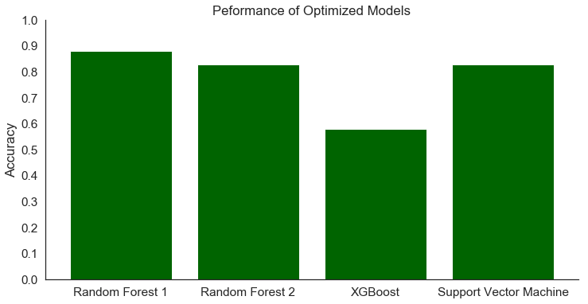


The main difference between Random Forest 1 and the other models was the preprocessing; Random Forest 1 used a training set that had been class-balanced, while the other models used the same training set after scaling and transformation with PCA. 

The confusion matrices and classification reports for all 8 models highlight some important features of this dataset. Classes 1 (Spruce/Fir) and 2 (Lodgepole Pine) are often confused for one another. These two classes are close in size to one another and the largest classes overall, so it's not a matter of not having enough data to distinguish the two. Apparently these two tree cover types occupy similar terrains. If there were a particular business need to distinguish the two, then models could be trained to more carefully distinguish them.


```python
# View confusion matrix for Random Forest 1
save_conf_matrix(y_test, y_pred_test_forest1, 'Random Forest 1')
```


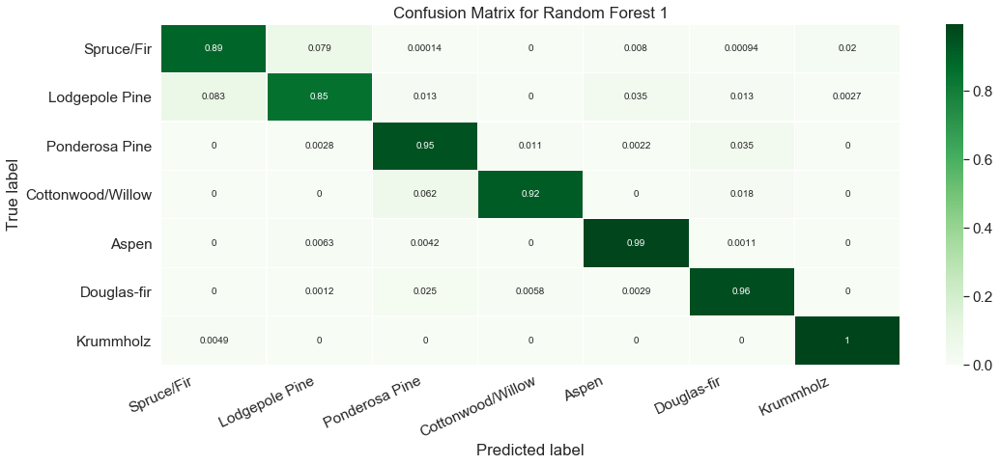


```python
# View ROC curves for Random Forest 1
roc_it(y_test, y_pred_test_forest1, 'Random Forest 1')
```


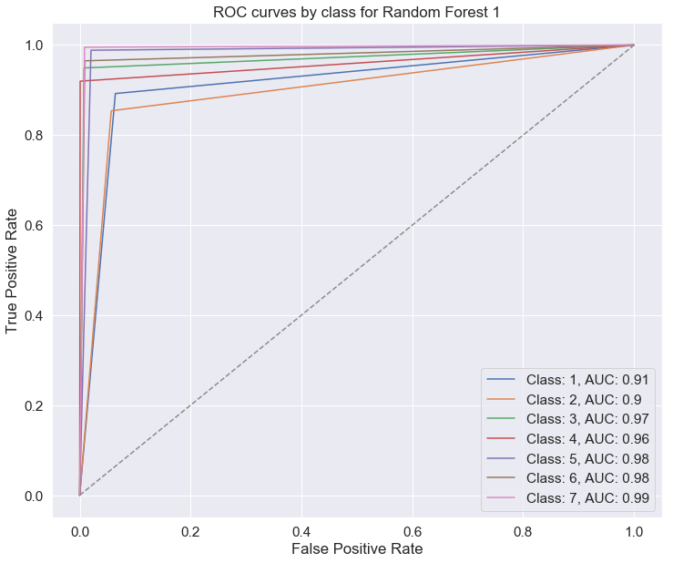


Another interesting feature of all the models is that they predict class 5 (Aspen) with low precision and high recall, most often misclassifying classes 1 and 2 as 5. In the full dataset, Aspen-covered tracts are found in the Rawah and Comanche Peak wilderness areas, which also contain the most tracts covered in Spruces/Firs and Lodgepole Pines. There are far fewer examples of the Aspen class, so it seems that the machine learning models are taking a scattershot approach to identifying them, correctly predicting most of the Aspens while also mistakenly labeling a number of Spruces and Lodgepole pines as Aspens. Again, if there were a particular business need to avoid this misclassification, a model could be trained to focus on correctly identifying these three classes with greater precision.

Random Forest 1, the overall best model, is encapsulated in the following pipeline. Keep in mind that it should be used with data that has not been scaled or transformed with PCA.


```python
# Instantiate best model pipeline
# pipe_forest1 = Pipeline([('forest1', RandomForestClassifier(max_depth=25,
#                                                             max_features=30,
#                                                             n_estimators=100))
#                         ])
```

## Recommendations

Here is how I recommend applying the outcomes of this project to business problems in land management:

1. Make multiple models for comparison

   By trying an assortment of models, it is possible to see not just which ones perform better, but which ones might perform better for a given task or under different constraints. 

2. Choose the model that's best for the problem at hand

   The model with the best overall accuracy score might not be the best model to use in every circumstance. If you have several models available, you can choose the right one for your needs, whether that's choosing one that identifies a certain class with greater precision, or one that can be more easily generalized to new data. 

3. A Random Forest model is a quick and easy way to get good results on raw data.

   When in doubt, a Random Forest model is a good choice for this type of data. This project has shown that a Random Forest can return good results even on raw data, so it's a great starting point if you want to start getting predictions quickly.

## Future work

There is a lot of potential for exciting future work on this dataset with machine learning. 

1. Refine site-specific models

   Given the different distributions of tree cover types from one wilderness area to the next, it might be worthwhile to develop a Random Forest model for each site. For instance, models for Rawah and Comanche Peak would need to be strong at distinguishing Spruces, Lodgepole Pines, and Aspens, but Cache la Poudre has a different ecology and would probably benefit from a model suited to its particular distribution of tree cover types.

2. Incorporate data from other regions

   It would also be interesting to try to generalize the models explored above to other regions, not just in Colorado.

3. Compare predictions to satellite images

   One benefit of predicting tree cover from cartographic data is that the data is much smaller to store than satellite images. It could be very useful, however, to use satellite images or other remote-sensor data to confirm model predictions for select sites.

4. Focus on areas critically affected by climate change

   As local and global climates change, it will be useful to compare predicted tree cover types with ground truth. The dataset for this project is a snapshot of tree cover up to 1998, and that is likely to change over the coming decades. Our current models for predicting tree cover from cartographic data will need to evolve to account for ecological changes that may be difficult to capture with this type of data.

## Additional visualizations

Below are the confusion matrices for Random Forest 2 and the Support Vector Classifier.


```python
# View confusion matrix for Random Forest 2
save_conf_matrix(y_test, y_pred_test_forest2, 'Random Forest 2')
```


```python
# View confusion matrix for Support Vector Classifier
save_conf_matrix(y_test, y_pred_test_svc, 'Support Vector Classifier')
```


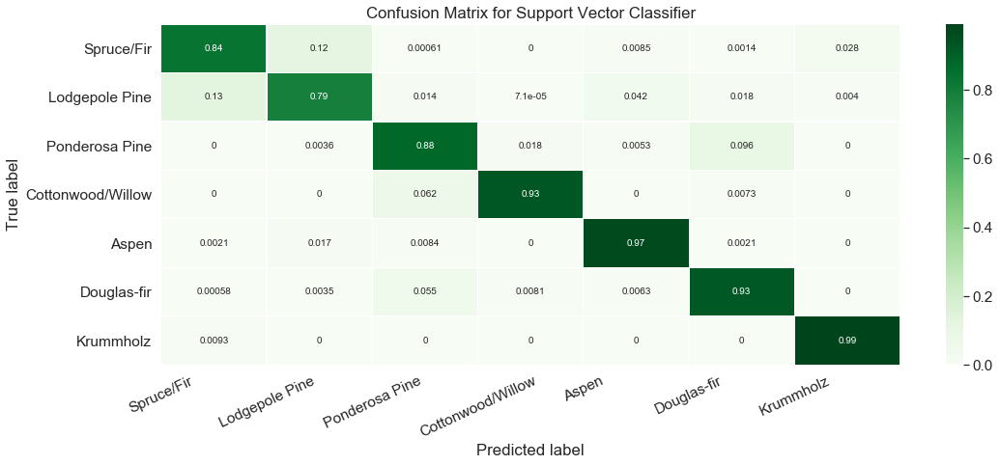


# Appendix

## Project description

This repository contains files from a project assigned to me as part of Flatiron School's Online Data Science Bootcamp. The purpose of the project is to demonstrate skills in machine learning.

Here's what you'll find inside:

* **random-forest-for-trees.ipynb**: Jupyter Notebook containing project code

* **presentation.pdf**: PDF file containing slides from a non-technical presentation of project results

The original dataset is about 75MB, and it can be found at http://kdd.ics.uci.edu/databases/covertype/. A description of the dataset, including a data dictionary, is here: http://kdd.ics.uci.edu/databases/covertype/covertype.data.html.

## Technical specifications

The dependencies for the notebook are: Python 3.7.3, Matplotlib, Numpy, Pandas, Seaborn, Itertools, Pickle, Collections, Imbalanced-Learn, Scikit-Learn, and XGBoost.

Because some of the models would have taken very long to run on my local machine, I did most of the modeling in Google Colab using a GPU runtime. If you decide to run the notebook on your own machine, even with a GPU, be advised that some of the models may take over an hour to run. In addition, the pickled models can be pretty large (>300MB), so if memory is an issue, you may want to skip over those cells.

## Related content

You can read my blog post about the project at this link: http://jrkreiger.net/uncategorized/evaluating-a-random-forest-model/.

View a video of my non-technical presentation here: https://youtu.be/OE_XyOspwNE.

## Authorship

The dataset for this project was published by Jock A. Blackard in 1998, and although it is free to reuse, Blackard and Colorado State University retain the copyright. You can find a description of the dataset here: http://kdd.ics.uci.edu/databases/covertype/covertype.data.html. The dataset itself is available at the last link on this page: http://kdd.ics.uci.edu/databases/covertype/. This dataset was also the subject of a Kaggle competition, which you can view here: https://www.kaggle.com/c/forest-cover-type-prediction/overview.

I wrote the code in the Jupyter Notebook, the text of this README, my blog post linked above, and the content of my non-technical presentation.
